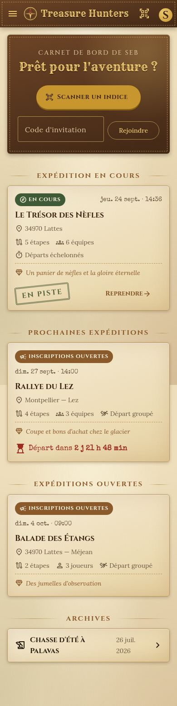
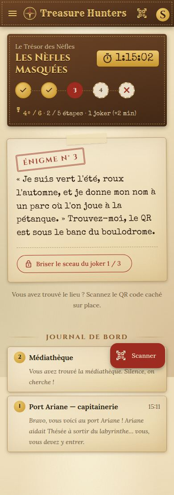
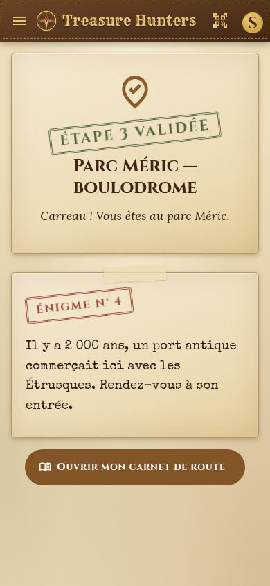
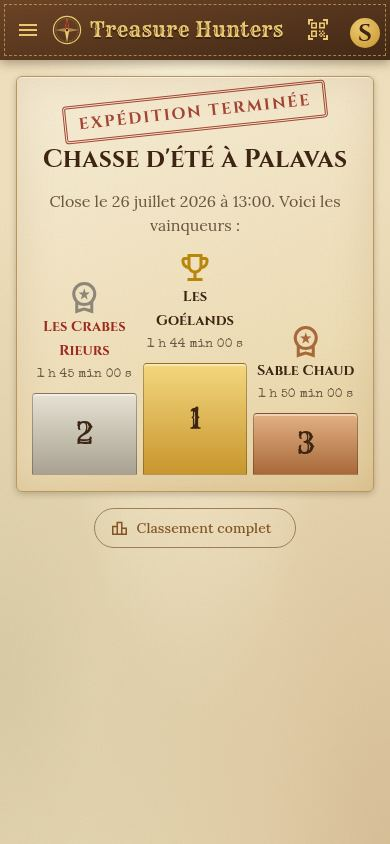
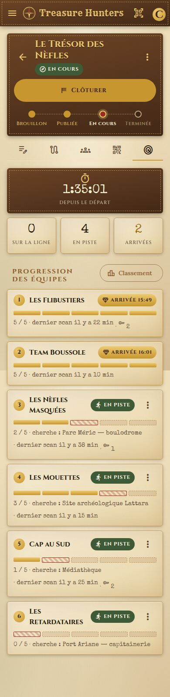
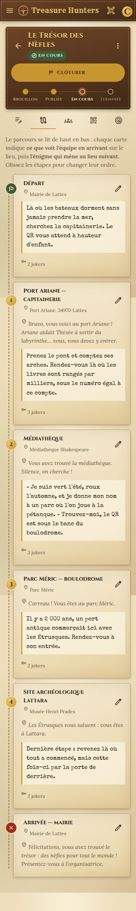
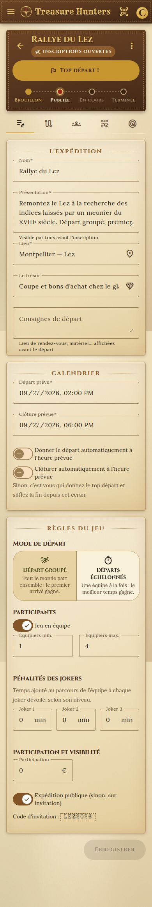
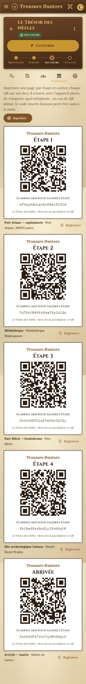

# Treasure Hunters

Application de chasses au trésor et de jeux de piste de type « rallye ». L'organisateur trace un parcours d'étapes et dépose un QR code à chaque lieu. Les équipes progressent d'énigme en énigme jusqu'au trésor. Deux modes de départ sont possibles : groupé ou échelonné. Le classement se fait toujours au temps de parcours.

- **Conception** (règles du jeu, modèle de données, API, écrans, décisions) : [`docs/conception.md`](docs/conception.md)

## Architecture

```
src/          front Angular 22 (PWA, Material 3), pensé d'abord pour le téléphone
server/       API Node.js (Fastify 5, pg, zod, argon2)
shared/       modèles, règles du jeu et jeu de démonstration, communs au front et au serveur
db/           schéma PostgreSQL (migrations SQL)
docs/         conception et captures d'écran
docker/       images web (nginx) et api (Node.js)
deploy/       déploiement Argo CD (pattern shared de platform-patterns)
```

Les règles du jeu (validation d'un scan, heures de départ, classement) sont écrites une seule fois, dans `shared/rules.ts`.

## Prérequis

- **Node.js ≥ 22.22.3 ou ≥ 24.15** (voir `.nvmrc`)
- **PostgreSQL ≥ 16**

## Démarrage en local

```bash
# 1. Base de données
createuser -P th                     # mot de passe : th
createdb -O th treasurehunters
createdb -O th treasurehunters_test  # pour les tests du serveur

# 2. API (http://localhost:3000) : applique les migrations au démarrage
cd server
npm install
npm run migrate
npm run seed:demo                    # jeu de démonstration (facultatif)
npm run dev

# 3. Front (http://localhost:4200), /api redirigé vers le serveur
cd ..
npm install
npm start
```

La configuration du serveur passe par des variables d'environnement (`DATABASE_URL`, `PORT`, `CORS_ORIGIN`, `SESSION_DAYS`) : voir `server/.env.example`.

Avec le jeu de démonstration, ouvrez **Guide de démonstration** (`/demo`) : chaque raccourci vous connecte avec le bon personnage et ouvre un écran dans un état précis. Les comptes sont `seb@example.com` (joueur) et `camille@example.com` (organisatrice), mot de passe `demo`.

### Maquettes sans back-end

```bash
npm run start:mock   # données simulées dans le navigateur, réinitialisées à chaque rechargement
```

## Tests

```bash
npm test                  # front (Vitest)
npm --prefix server test  # règles du jeu + API sur une vraie base PostgreSQL (TEST_DATABASE_URL)
```

## Déploiement (Kubernetes, Argo CD)

L'application suit le pattern **`shared`** de [platform-patterns](https://github.com/hseb72/platform-patterns) sur la plateforme mutualisée [homelab-platform](https://github.com/hseb72/homelab-platform) : voir **[`deploy/README.md`](deploy/README.md)**.
- Chaque commit sur `master` construit les images `ghcr.io/hseb72/treasurehunters/{web,api}` (`.github/workflows/build-images.yml`).
- La CI promeut leur SHA dans `deploy/values-image.yaml` (`deploy.yml`).
- Argo CD applique ensuite ce SHA.

## Production sans Kubernetes

```bash
npm run build                  # front statique dans dist/treasurehunters/browser
npm --prefix server run build  # API compilée dans server/dist
node server/dist/server/src/main.js
```

Le front doit être servi sur le même domaine que l'API (`/api`), derrière un proxy (nginx, Caddy…), avec un repli sur `index.html` pour les routes Angular. Les QR codes pointent vers `https://<domaine>/q/<jeton>` : le domaine doit donc rester stable une fois les QR imprimés.

## Aperçu

| Carnet de bord | Carnet de route | Étape validée | Podium |
|---|---|---|---|
|  |  |  |  |

| Pilotage en direct | Parcours | Paramètres | Planche de QR |
|---|---|---|---|
|  |  |  |  |
