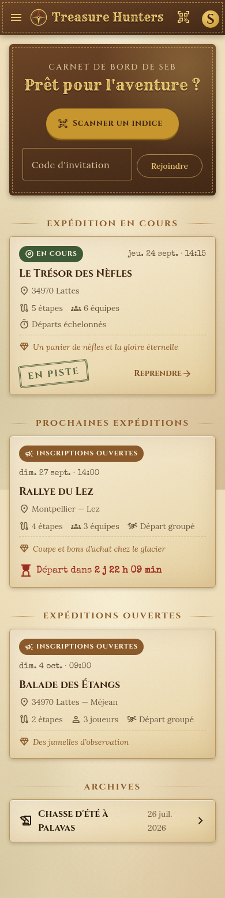
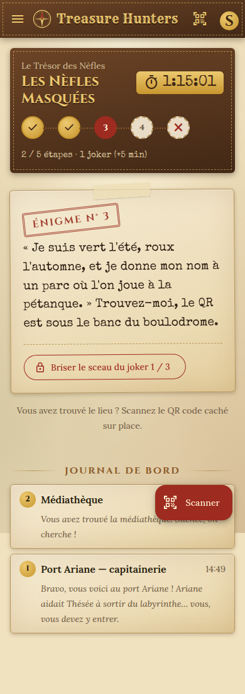
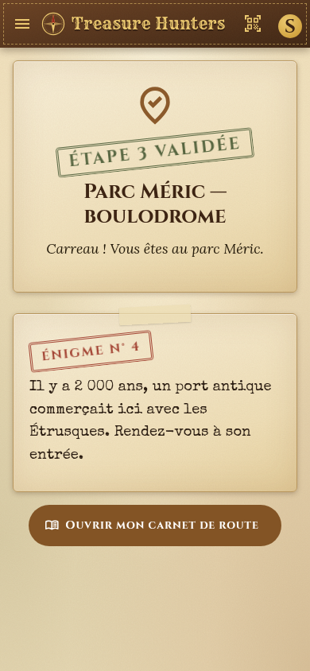
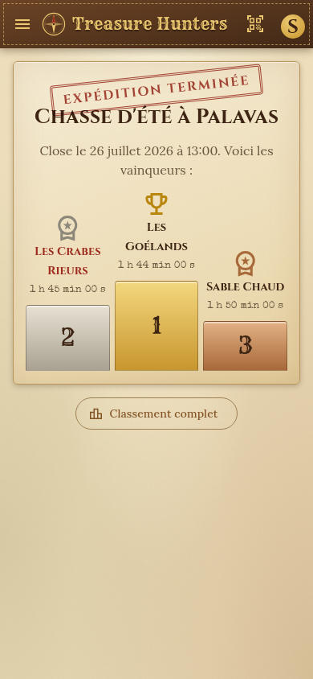
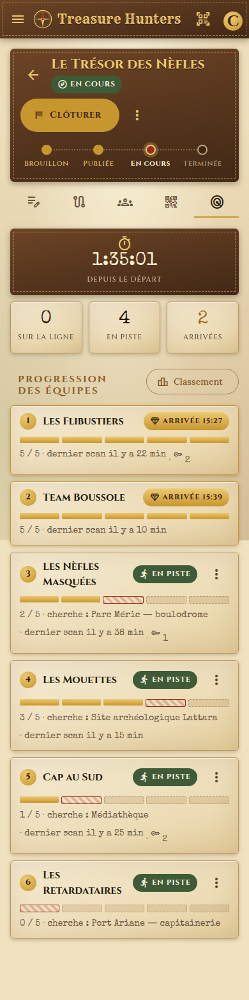
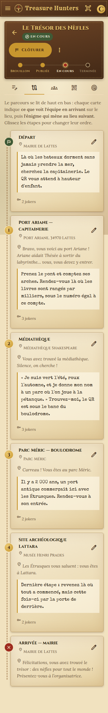
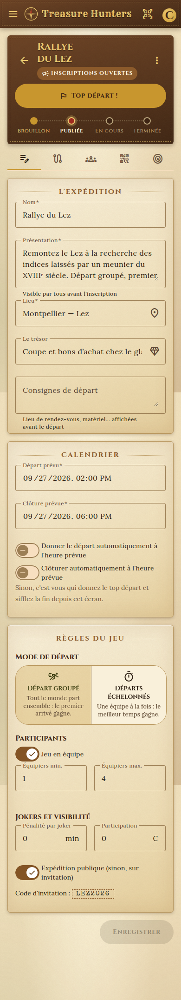
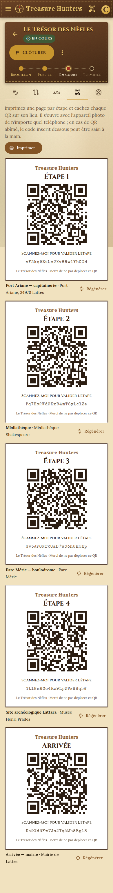

# Treasure Hunters

Application de chasses au trésor et de jeux de piste de type « rallye » : l'organisateur trace un parcours d'étapes, dépose un QR code à chaque lieu, et les équipes progressent d'énigme en énigme jusqu'au trésor.

- **Conception** (règles du jeu, modèle de données, API, écrans) : [`docs/conception.md`](docs/conception.md)
- **Front-end** : Angular 22 (composants autonomes, signals), Angular Material 3, PWA.

## État actuel : maquettes

Les écrans fonctionnent avec un **back-end simulé en mémoire** (`src/app/core/mock/`). Il applique les règles du jeu (`src/app/core/rules.ts`) exactement comme le fera le serveur. Les données sont recalculées à chaque chargement, pour que la chasse de démonstration soit toujours « en cours ».

Après le lancement, ouvrez **Guide des maquettes** (`/demo`) : chaque raccourci vous connecte avec le bon personnage (joueur, organisatrice ou visiteur) et ouvre un écran dans un état précis. Les comptes de démonstration sont `seb@example.com` et `camille@example.com`, mot de passe `demo`.

Pour brancher le vrai back-end, il suffira de remplacer `MockHuntApi` par un client HTTP qui implémente `HuntApi` (`src/app/core/api.ts`), dans `app.config.ts`.

## Développement

Prérequis : **Node.js ≥ 22.22.3 ou ≥ 24.15** (voir `.nvmrc`).

```bash
npm install
npm start          # http://localhost:4200
npm test           # tests unitaires (Vitest)
npm run build      # build de production dans dist/
```

## Arborescence

```
src/app/
  core/          modèles, contrat d'API, règles du jeu, session, back-end simulé
  shared/        composants communs (carte de chasse, piste, podium, badges…)
  pages/         un dossier par écran ; organize/ = espace organisateur
docs/            conception
```

## Aperçu

| Carnet de bord | Carnet de route | Étape validée | Podium |
|---|---|---|---|
|  |  |  |  |

| Pilotage en direct | Parcours | Paramètres | Planche de QR |
|---|---|---|---|
|  |  |  |  |
