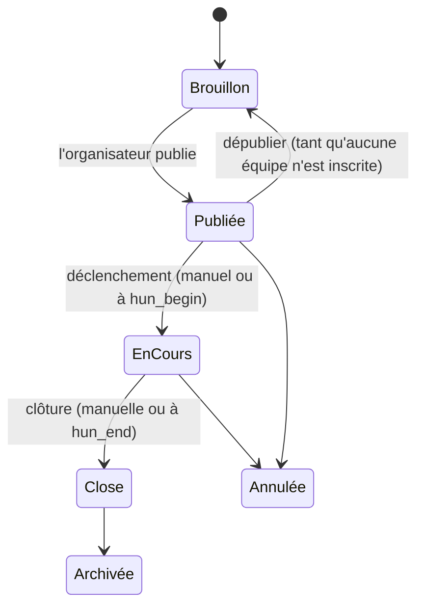
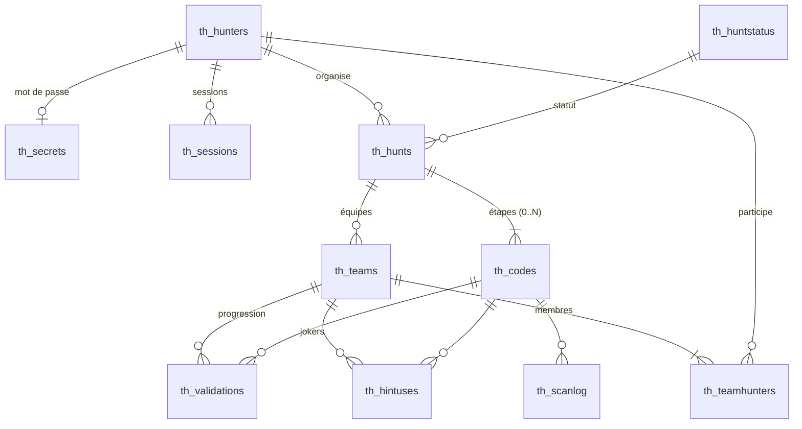

# Treasure Hunters — Document de conception

> Statut : **validé** · Version 0.2 · 24/09/2026 — décisions intégrées, base PostgreSQL

Ce document décrit le fonctionnement cible de l'application : le vocabulaire, les règles du jeu, le modèle de données, l'API et les écrans. Il sert de référence pour le schéma SQL (`db/`), le back-end (`server/`) et le front-end (`src/`). Les décisions prises et les évolutions envisagées sont regroupées à la fin (§ 10).

---

## 1. Vocabulaire

| Terme | Définition | Table |
|---|---|---|
| **Joueur** (*hunter*) | Personne qui a un compte. Il peut organiser des chasses et participer à d'autres. | `th_hunters` |
| **Chasse** (*hunt*) | Un jeu de piste : un parcours d'étapes, une période de jeu, un mode de départ. | `th_hunts` |
| **Organisateur** | Le joueur propriétaire de la chasse (`hun_owner_htr`). | — |
| **Étape** (*code*) | Un lieu du parcours. Un QR code y est déposé. La scanner valide l'étape et révèle l'énigme de la suivante. | `th_codes` |
| **Départ** | L'étape d'ordre 0. Elle n'a pas de QR : son énigme est révélée à l'équipe à son heure de départ. | `th_codes` (ordre 0) |
| **Arrivée** | La dernière étape. La scanner arrête le chronomètre de l'équipe. | `th_codes` (ordre max) |
| **Équipe** (*team*) | Le groupe qui progresse. **Dans une chasse en solo, chaque joueur forme une équipe d'une personne.** Toutes les règles s'écrivent donc une seule fois, pour des équipes. | `th_teams` |
| **Validation** | Le fait qu'une équipe a atteint une étape, par un scan ou manuellement par l'organisateur. | `th_validations` |
| **Joker** | Un indice supplémentaire (1 à 3 par énigme) que l'équipe peut dévoiler, avec une pénalité en minutes qui dépend de son niveau. | `th_hintuses` |
| **Abandon** (« 4ᵉ joker ») | L'équipe renonce au lieu qu'elle cherche et passe directement à l'énigme suivante, moyennant une pénalité de temps. L'arrivée ne s'abandonne pas. | `th_validations` (source `SKIP`) |

---

## 2. Cycle de vie d'une chasse

| Statut (`th_huntstatus`) | Id | Joueurs | QR codes |
|---|---|---|---|
| Brouillon | 1 | invisible | « Cette chasse n'existe pas » |
| Publiée | 2 | visible, inscriptions ouvertes | « **Pas encore commencée** » et compte à rebours vers `hun_begin` |
| En cours | 3 | on joue | actifs, selon les règles du § 4 |
| Close | 4 | résultats | « **Terminée** » et **podium** |
| Annulée | 5 | message d'annulation | « Chasse annulée » |
| Archivée | 6 | historique uniquement | comme Close |

- `hun_begin` et `hun_end` sont les dates **prévues**. `hun_started` et `hun_closed` sont les horodatages **réels**. Ils sont posés par le bouton « Démarrer » / « Clôturer » de l'organisateur, ou automatiquement à l'heure prévue si `hun_autostart` / `hun_autoclose` vaut 1.
- La période de validité des QR va de `hun_started` à `hun_closed`, jamais au-delà.

---

## 3. Déroulement d'une partie

### 3.1 Préparation (organisateur)
1. Il crée la chasse : nom, description, lieu, dates prévues, lot, public/privé, solo/équipe (avec une taille min/max), **mode de départ** (§ 5).
2. Il saisit les étapes dans l'ordre :
   - **Départ (ordre 0)** : l'énigme qui mène à l'étape 1, et ses jokers.
   - **Étapes 1 à N-1** : un message d'arrivée (« Bravo, vous êtes à la fontaine ! »), l'énigme vers l'étape suivante, les jokers et, pour son usage à lui seulement, une position GPS.
   - **Arrivée (ordre N)** : le message final.
3. Il imprime les QR codes (une page par étape, avec son numéro et son titre) et les dépose sur place.
4. Il publie la chasse.

### 3.2 Inscription (joueurs)
- **Chasse publique** : elle apparaît dans la liste des chasses.
- **Chasse privée** : on la rejoint avec son code d'invitation (`hun_joincode`) ou un lien.
- **Chasse en équipe** : un joueur crée une équipe et devient capitaine. Il partage le code de l'équipe (`tea_joincode`) et les autres la rejoignent.
- **Chasse en solo** : l'inscription crée automatiquement une équipe d'une personne, qui porte le pseudo du joueur.
- **Un joueur ne peut être que dans une seule équipe par chasse.** C'est une contrainte de la base de données.

### 3.3 Jeu
1. **Déclenchement** : l'organisateur démarre la chasse. Chaque équipe reçoit une heure de départ (§ 5).
2. À son heure de départ, l'équipe voit l'**énigme du départ** dans l'application.
3. Arrivée sur une étape, un membre de l'équipe scanne le QR. Le scan valide l'étape pour **toute l'équipe** : les autres membres voient la progression en rafraîchissant.
4. L'énigme de l'étape suivante apparaît. Les jokers se dévoilent un par un et sont partagés par l'équipe.
5. Le scan de l'**arrivée** fixe l'heure d'arrivée de l'équipe (`tea_finished`).
6. **Clôture** : les QR deviennent inactifs et les résultats sont publiés.

---

## 4. Scanner un QR code

### 4.1 Contenu du QR
Le QR contient une URL : `https://<domaine>/q/<jeton>`.
- N'importe quel appareil photo de téléphone l'ouvre, sans passer par l'application. Le scanner intégré (bouton QR de la barre du haut) reste disponible en plus.
- Le `<jeton>` fait 22 caractères aléatoires en base62 (≈ 128 bits). **Il ne se déduit ni de l'identifiant de la chasse ni du numéro de l'étape**, donc on ne peut pas deviner le QR suivant.
- L'organisateur peut **régénérer** le jeton d'une étape (en cas de fuite, par exemple si une photo circule). Il doit alors réimprimer le QR.

### 4.2 Algorithme de validation (côté serveur)

Les tests s'appliquent dans cet ordre. Le premier qui correspond détermine la réponse.

| # | Condition | Écran affiché | Enregistré ? |
|---|---|---|---|
| 1 | Jeton inconnu, ou chasse en brouillon | « QR code inconnu » | journal |
| 2 | Chasse annulée | « Chasse annulée » | journal |
| 3 | Chasse pas encore démarrée | « **Pas encore commencée** », avec la date prévue et un compte à rebours | journal |
| 4 | Chasse close ou archivée | « **Terminée** », avec le **podium** | journal |
| 5 | Joueur non connecté | Connexion ou inscription, puis retour automatique sur ce QR | — |
| 6 | Joueur organisateur de cette chasse | « Mode organisateur » : vérification que le QR fonctionne et aperçu de l'étape | — |
| 7 | Joueur non inscrit à la chasse | Présentation de la chasse et bouton « Rejoindre » | — |
| 8 | Départ de l'équipe pas encore donné (départ échelonné) | « Votre départ est prévu à 10 h 15 » et compte à rebours | journal |
| 9 | Équipe déjà arrivée | « Vous avez terminé ! », avec le temps et le classement provisoire éventuel | journal |
| 10 | Étape déjà validée par l'équipe | Réaffichage de l'énigme suivante, sans nouvelle validation | — |
| 11 | Étape précédente pas encore validée | « **Vous avez sauté une étape** », sans révéler aucun contenu | journal |
| 12 | Sinon | **Étape validée** : message d'arrivée, puis énigme suivante (ou écran d'arrivée) | validation + journal |

- Le serveur n'envoie **jamais** au client l'énigme d'une étape qui n'est pas encore débloquée. Ce contrôle ne peut pas se faire uniquement dans le front.
- Toutes les tentatives sont écrites dans `th_scanlog`. On peut ainsi détecter les tentatives de triche et aider l'organisateur en cas de litige.
- Si un QR a été arraché ou abîmé, l'organisateur peut **valider manuellement** une étape pour une équipe depuis l'écran de pilotage. `val_source` vaut alors `MANUAL`, et `val_by_htr` enregistre qui a validé.

### 4.3 Ordre des étapes
Par défaut, les étapes sont **linéaires** : l'étape *n* n'est acceptée que si l'étape *n-1* est validée. C'est le principe du rallye, où chaque énigme mène à la suivante. Un mode « ordre libre » est envisageable plus tard (§ 10).

---

## 5. Modes de départ et classement

### 5.1 Deux modes de départ (`hun_startmode`)

| Mode | Valeur | Heure de départ de l'équipe (`tea_started`) |
|---|---|---|
| **Départ groupé** | 1 | `hun_started` pour toutes les équipes |
| **Départ échelonné** | 2 | `hun_started + (tea_startorder − 1) × hun_interval` |

- En départ échelonné, l'organisateur fixe l'**intervalle** en minutes (`hun_interval`) et l'**ordre de passage** (`tea_startorder`). Il peut ranger les équipes à la main ou lancer un tirage au sort.
- Au déclenchement, le serveur calcule et enregistre `tea_started` pour chaque équipe. Si une équipe se présente en retard, l'organisateur peut **retarder** son départ. On ne peut jamais l'avancer avant l'heure de déclenchement.

### 5.2 Une seule règle de classement

> **Temps de course = heure d'arrivée − heure de départ + pénalités (jokers et abandons)**
> `temps = tea_finished − tea_started + Σ pénalité(niveau du joker) + nb_abandons × hun_skippenalty`

- En **départ groupé**, toutes les heures de départ sont égales, donc le plus petit temps correspond au **premier arrivé**. Une seule formule couvre les deux modes.
- **Pénalités de jokers, par niveau** (`hun_penalty1`, `hun_penalty2`, `hun_penalty3`, en minutes, 0 par défaut). Exemple : joker 1 = +2 min, joker 2 = +5 min, joker 3 = +10 min. Les jokers d'une énigme se dévoilent dans l'ordre, donc le joker 2 n'est accessible qu'après le 1.
- **Abandon d'une épreuve** (`hun_skippenalty`, en minutes, 30 par défaut) : une équipe bloquée peut renoncer au lieu qu'elle cherche. L'étape est enregistrée comme validation de source `SKIP`, sans QR, et l'énigme suivante s'affiche aussitôt. Le QR de l'étape abandonnée, s'il est trouvé plus tard, n'apporte plus rien (« déjà validée »). **L'arrivée ne s'abandonne pas** : il faut trouver le trésor pour être classé. L'abandon est confirmé à part et se sérialise avec les scans de l'équipe.
- **Égalité** : on départage par l'heure d'arrivée la plus tôt, puis par le nombre de jokers et d'abandons.
- **Équipes non arrivées à la clôture** : elles sont **non classées** et apparaissent après les équipes classées. On les trie par nombre d'étapes validées (décroissant), puis par le temps écoulé entre leur départ et leur dernière validation (croissant). Ce critère reste juste en départ échelonné.

### 5.3 Visibilité des résultats
- Pendant la course, l'**organisateur** voit le tableau de pilotage en direct et le classement provisoire complet.
- Chaque **joueur** voit uniquement la **position provisoire de sa propre équipe** (« 4ᵉ / 6 »), jamais celle des autres. Cette position est calculée avec les mêmes règles que le classement final.
- Après la clôture, le **podium** et le classement complet sont publics. Ce sont eux que montre un scan de QR après la fin.

### 5.4 Où sont codées ces règles

Les règles du jeu (§ 4.2 et § 5) sont écrites **une seule fois**, en TypeScript, dans `shared/rules.ts` : `evaluateScan`, `teamStartTimes`, `computeRanking`, `teamPosition`, `hintPenaltyMinutes`, `penaltyMinutes`. Elles sont couvertes par `shared/rules.spec.ts` et utilisées à la fois par le serveur et par le back-end simulé des maquettes.

---

## 6. Modèle de données (PostgreSQL)

Le schéma est dans `db/migrations/001_initial.sql`. Le serveur l'applique au démarrage, ou via `npm run migrate`, et note les scripts appliqués dans `th_migrations`. On garde les conventions de la première version :
- préfixe `th_` et trigramme par table ;
- clés étrangères nommées `<col>_<trigramme cible>` ;
- colonnes `_creation` / `_lastupdate`.

Les dates sont en `timestamptz` (UTC). Les clés primaires sont des colonnes `GENERATED ALWAYS AS IDENTITY` et les booléens de vrais `boolean`. Des contraintes `CHECK` protègent les règles simples : dates cohérentes, taille d'équipe, niveau de joker de 1 à 3, etc.

### 6.1 Tables et différences avec la base MariaDB d'origine

**`th_hunters`** (joueurs)
- Le pseudo et l'e-mail sont uniques sans tenir compte de la casse (index sur `lower(...)`).
- L'e-mail est vérifié par une expression régulière.
- Nouvelle colonne `htr_emailverified`.

**`th_secrets`** — `sec_password` contient un **hash argon2id**. Il y a au plus un secret par joueur.

**`th_sessions`**
- On ne stocke que `ses_tokenhash`, le SHA-256 du jeton aléatoire remis au client, jamais le jeton lui-même.
- `ses_expires` : 30 jours par défaut.
- `ses_useragent` enregistre le navigateur utilisé.

**`th_huntstatus`** — 6 statuts, avec un `hst_code` (`draft`, `published`, `running`, `closed`, `cancelled`, `archived`) exposé par l'API.

**`th_hunts`** (chasses)

| Colonne | Type | Rôle |
|---|---|---|
| `hun_begin` / `hun_end` | timestamptz | dates prévues, avec `hun_end > hun_begin` |
| `hun_started` / `hun_closed` | timestamptz NULL | horodatages réels du déclenchement et de la clôture |
| `hun_autostart` / `hun_autoclose` | boolean | déclenchement et clôture automatiques ; le serveur vérifie toutes les 30 s |
| `hun_startmode` | smallint | 1 = groupé, 2 = échelonné (remplace `hun_mode`) |
| `hun_interval` | smallint NULL | minutes entre deux départs, obligatoire en mode échelonné |
| `hun_penalty1..3` | smallint | minutes de pénalité par niveau de joker |
| `hun_skippenalty` | smallint | minutes de pénalité par épreuve abandonnée (migration 002) |
| `hun_teamgame`, `hun_teammin`, `hun_teammax` | boolean, smallint | solo ou équipes, et taille des équipes |
| `hun_public`, `hun_joincode` | boolean, varchar(12) UNIQUE | visibilité et code d'invitation |
| `hun_contribution` | numeric(10,2) | participation, affichée seulement |
| `hun_starttext`, `hun_award` | text | consignes de départ, trésor |

**`th_codes`** (étapes)
- `cod_order` : 0 = départ, puis 1..N. La contrainte UNIQUE(chasse, ordre) est *différable*, pour pouvoir réordonner les étapes dans une transaction.
- `cod_longid` : jeton aléatoire du QR code, NULL seulement pour le départ (contrainte `ck_cod_token`).
- `cod_arrival` : message affiché au scan. `cod_instructions` : énigme vers l'étape suivante. `cod_hint1..3` : les jokers.
- `cod_latitude`, `cod_longitude`, `cod_address` : position, visible par l'organisateur seulement.
- `cod_answer` : réservé aux énigmes à réponse (§ 10.2).

**`th_teams`** (équipes)
- `tea_joincode` UNIQUE, `tea_solo`, `tea_startorder`, `tea_started`, `tea_finished`.
- UNIQUE(chasse, nom).
- UNIQUE(`tea_id`, `tea_hunt_hun`) sert de cible à la clé composite de `th_teamhunters`.

**`th_teamhunters`** (membres)
- `thr_hunt_hun` est une copie de la chasse, gardée cohérente par la clé étrangère composite (`thr_team_tea`, `thr_hunt_hun`).
- La contrainte **UNIQUE(`thr_hunt_hun`, `thr_hunter_htr`)** garantit qu'un joueur n'est que dans **une seule équipe par chasse**.

**`th_validations`** (remplace `th_huntercodes` pour la progression)
- `val_team_tea`, `val_code_cod` et `val_hunter_htr`, le membre qui a scanné.
- `val_source` vaut `QR`, `MANUAL`, `SKIP` (épreuve abandonnée par l'équipe) ou `GEO` (arrivée validée par géolocalisation, § 11.3). `val_by_htr` n'est rempli que pour une validation manuelle par l'organisateur ; il remplace `htc_giftedby_htr`.
- `val_creation` est l'**heure de passage**.
- UNIQUE(équipe, étape).

**`th_hintuses`** (remplace `htc_hint1..3`) : l'équipe, l'étape, le niveau (1 à 3), le joueur qui a ouvert le joker et l'heure. UNIQUE(équipe, étape, niveau).

**`th_scanlog`** : toutes les tentatives de scan, avec le jeton, le joueur, l'équipe, le résultat (§ 4.2) et l'adresse IP.

### 6.2 Concurrence
Deux équipiers peuvent scanner le même QR au même instant. Le serveur **verrouille la ligne de l'équipe** (`SELECT … FOR UPDATE`) pendant l'évaluation du scan : un seul des deux valide l'étape, l'autre obtient « déjà validée ». L'ouverture d'un joker, l'arrivée d'un équipier et le déclenchement sont protégés de la même façon.

---

## 7. API REST

Serveur : `server/src/app.ts`. Préfixe `/api`, JSON, noms de champs en camelCase, types dans `shared/models.ts`.
- **Authentification** : `Authorization: Bearer <jeton>`.
- **Erreurs** : `{ message }` avec le statut 400, 401, 403, 404, 409 ou 429.
- **Limitation du nombre de requêtes** : sur la connexion, l'inscription, l'arrivée dans une équipe et les scans.

| Méthode & chemin | Rôle | Accès |
|---|---|---|
| `POST /auth/register` · `POST /auth/login` | création de compte et connexion → `{ user, token }` | public |
| `POST /auth/logout` · `GET /me` · `PATCH /me` | session et profil | connecté |
| `GET /hunts?scope=public\|playing\|organized` | listes de chasses | public / connecté |
| `GET /hunts/:id` · `GET /hunts/by-code/:code` | détail, recherche par code d'invitation (chasse ou équipe) | selon visibilité |
| `POST /hunts` · `PATCH /hunts/:id` | création et modification ; les règles sont figées une fois la course lancée | organisateur |
| `POST /hunts/:id/publish\|unpublish\|start\|close\|cancel` | cycle de vie | organisateur |
| `GET /hunts/:id/steps` · `POST /hunts/:id/steps` · `PUT /hunts/:id/steps/order` | parcours | organisateur |
| `PATCH /steps/:id` · `DELETE /steps/:id` · `POST /steps/:id/regenerate` | une étape, nouveau jeton QR | organisateur |
| `GET /hunts/:id/teams` · `POST /hunts/:id/teams` · `POST /hunts/:id/solo` | équipes, inscription | connecté |
| `GET /hunts/:id/my-team` · `DELETE /hunts/:id/my-team` · `POST /teams/join` | mon équipe, quitter, rejoindre par code | connecté |
| `PUT /hunts/:id/teams/order` · `POST /teams/:id/delay` | ordre de passage, décalage d'un départ | organisateur |
| `GET /hunts/:id/play` · `POST /hunts/:id/hints` · `POST /hunts/:id/skip` | carnet de route de mon équipe (avec sa position provisoire), joker suivant, abandon de l'épreuve en cours | membre |
| `POST /hunts/:id/checkin` · `POST /hunts/:id/self-start` | « Je suis arrivé » (validation par géolocalisation, § 11.3), départ d'une chasse surprise | membre |
| `PUT /hunts/:id/self-paced` | chasse surprise : « chacun son chrono » ou départ commun (§ 11.4) | hôte |
| `POST /hunts/generate` · `GET /generations/:id` | invention d'une chasse (§ 11), suivi de la génération | connecté |
| `POST /scan/:token` | **scan** : § 4.2, journalisé. En POST, parce qu'un scan peut valider une étape | public (plus de détails si connecté) |
| `GET /hunts/:id/results` | classement : l'organisateur pendant la course, tout le monde après la clôture | selon § 5.3 |
| `GET /hunts/:id/live` · `POST /teams/:id/validations` | pilotage en direct, validation manuelle | organisateur |

---

## 8. Écrans

Tous les écrans sont conçus **d'abord pour le téléphone**, pour les joueurs comme pour les organisateurs. Ils s'élargissent ensuite sur tablette et ordinateur.

| # | Écran | Route | Qui |
|---|---|---|---|
| E1 | Carnet de bord : expédition en cours, prochaines expéditions, expéditions ouvertes, archives, code d'invitation | `/` | tous |
| E2 | Connexion / inscription | `/login` | public |
| E3 | Fiche d'expédition et inscription (fonder ou rejoindre une équipe, solo) | `/hunts/:id` | tous |
| E4 | **Carnet de route** : chrono, piste, énigme, jokers sous scellés, position provisoire, journal | `/play/:huntId` | membre |
| E5 | **Résultat de scan** : les états du § 4.2 | `/q/:token` | tous |
| E6 | **Podium et classement** | `/hunts/:id/results` | selon § 5.3 |
| E7 | Scanner intégré (caméra, ou saisie du code si le QR est abîmé) | `/scan` | tous |
| E8 | Mes expéditions | `/organize` | organisateur |
| E9 | Espace de l'expédition, onglet **Infos** : présentation, calendrier, règles, pénalités | `/organize/:id/info` | organisateur |
| E10 | Onglet **Étapes** : parcours réordonnable, énigmes, jokers | `/organize/:id/steps` | organisateur |
| E11 | Onglet **Équipes** : inscrits, ordre de passage, tirage au sort | `/organize/:id/teams` | organisateur |
| E12 | Onglet **QR codes** : planche imprimable | `/organize/:id/qrcodes` | organisateur |
| E13 | Onglet **Direct** : progression, validation manuelle, retard de départ | `/organize/:id/live` | organisateur |
| E14 | Profil | `/me` | connecté |
| E15 | **Chasse sur mesure** : lieu (ville, carte, ma position), durée, difficulté, « je joue » ou « j'organise », puis attente | `/generate` | connecté |

---

## 9. Choix techniques

- **Front** (`src/`) : Angular 22 avec des composants autonomes (*standalone*), les *signals* et Material 3. C'est une PWA installable. Le thème « carnet d'explorateur » est défini dans `src/styles.scss`. Les polices (Cinzel, Lora, Rye, Special Elite et les icônes Material Symbols) sont **servies par l'application** depuis les paquets `@fontsource`, jamais par un CDN : un CDN bloqué ou lent faisait apparaître le nom des icônes à leur place. Le front dialogue avec l'API via `HttpHuntApi`, ou avec `MockHuntApi` pour les maquettes autonomes (`npm run start:mock`).
- **Back-end** (`server/`) :
  - Node.js avec Fastify 5 ;
  - `pg` et des requêtes SQL écrites à la main (`server/src/repo.ts`) ;
  - `zod` pour valider les données reçues ;
  - `@node-rs/argon2` pour hasher les mots de passe.
- **Base** : PostgreSQL 16 ou plus.
- **Code partagé** (`shared/`) : modèles, règles du jeu et jeu de démonstration, utilisés par les trois parties.
- **Heures** : tout est stocké en UTC. Les horodatages de jeu (départ, passages, arrivée) viennent de l'horloge du serveur.
- **Déploiement** : Kubernetes (k3s), pattern `shared` de platform-patterns sur le socle homelab-platform, piloté par Argo CD. Voir `deploy/README.md`.
- **Tests** : `shared/rules.spec.ts` pour les règles. `server/test/` contient les tests d'intégration sur une vraie base PostgreSQL : cycle de vie complet, scans simultanés, jokers, droits d'accès.

---

## 10. Décisions et évolutions

### 10.1 Décisions (septembre 2026)

| Question | Décision |
|---|---|
| Back-end | **Node.js** (Fastify) |
| Base de données | **PostgreSQL** |
| Ordre des étapes | **Linéaire** |
| Énigmes à réponse | Pas dans un premier temps ; la colonne `cod_answer` est réservée |
| Pénalité des jokers | **Une valeur par niveau** de joker, fixée pour la chasse |
| Abandon d'une épreuve | **« 4ᵉ joker »** : pénalité de temps réglable par chasse (30 min par défaut), accès à l'énigme suivante ; l'arrivée ne s'abandonne pas |
| Classement pendant la course | Chaque équipe ne voit **que sa propre position** ; l'organisateur voit tout |
| `htc_giftedby_htr` | Remplacé par la **validation manuelle** par l'organisateur (`val_source = 'MANUAL'`, `val_by_htr`) |
| Participation (`hun_contribution`) | **Affichage seul** dans la première version |
| Chasse générée : validation | **Géolocalisation** (« Je suis arrivé » dans un rayon de 40 m par défaut), pas de QR code |
| Chasse générée : lieux | **OpenStreetMap** (Nominatim, Overpass) : uniquement des lieux réels, coordonnées jamais inventées |
| Chasse générée : énigmes | **Claude** (API Anthropic) : choix du parcours, énigmes, jokers, messages d'arrivée |

### 10.2 Évolutions envisagées

- **Preuve par photo** (prochaine fonctionnalité) : si un QR a disparu ou a été abîmé, l'équipe photographie le lieu qu'elle pense être la solution. L'organisateur, ou une IA comparant avec une photo de référence, valide la photo (`val_source = 'PHOTO'`) ; l'heure d'envoi compte pour le classement.

- **Mode « neuronal »** : le parcours devient un graphe plutôt qu'une ligne. Plusieurs énigmes se résolvent **en parallèle**, et leur réunion ouvre la voie à de nouvelles énigmes. Pistes pour le modèle :
  - une table de dépendances entre étapes `th_codelinks (cdl_from_cod, cdl_to_cod)` ;
  - la règle « l'étape *n* n'est accessible que si l'étape *n-1* est validée » devient « toutes ses étapes prérequises sont validées » ;
  - `evaluateScan` et `lastValidatedOrder` sont les deux fonctions à généraliser ;
  - la piste de progression devient une petite carte.
- **Énigmes à réponse** : l'équipe saisit la réponse (`cod_answer`) avant de voir le message d'arrivée ou l'énigme suivante. Il faudra une comparaison tolérante (casse, accents) et une limite de tentatives.
- **Paiement en ligne** de la participation, pour une version beaucoup plus avancée.
- **Notifications** : « votre départ est dans 5 minutes », « un équipier a trouvé l'étape 3 ».

---

## 11. Chasses générées

Un joueur peut demander à l'application d'**inventer une chasse** à partir de trois souhaits : un lieu, une durée approximative, une difficulté (ou un nombre d'étapes). Il choisit ensuite d'y **jouer en surprise** ou d'en **devenir l'organisateur**.

### 11.1 Demande

| Souhait | Valeurs |
|---|---|
| Lieu | un nom de ville ou d'adresse (géocodé par Nominatim), un point touché sur la carte, ou la position du téléphone |
| Durée | 20 min à 6 h ; elle fixe le rayon de recherche des lieux (≈ 15 m par minute, entre 300 m et 2,5 km) |
| Difficulté | Balade (famille), Aventure, Expédition (énigmes cryptiques) |
| Étapes | déduites de la durée (10, 12 ou 15 min par étape selon la difficulté), ou choisies : 3 à 12, arrivée comprise |
| Mode | `play` : chasse surprise pour soi · `organize` : brouillon à relire et à proposer à des joueurs |

Règles communes au serveur et aux maquettes : `shared/generation.ts`.

### 11.2 Génération

La génération dure de quelques secondes à une minute. Elle tourne **en tâche de fond** :

1. `POST /hunts/generate` enregistre la demande dans `th_generations` (statut `pending`) et répond **202** avec son identifiant.
2. Le serveur cherche les lieux remarquables et nommés autour du point avec **Overpass** : monuments, statues, fontaines, œuvres d'art, lieux de culte, points de vue, parcs… Une seule requête, au double du rayon visé (3 km au plus), sur une **boîte englobante** (`bbox`, indexée : un filtre `around` sur ces clés fait expirer les instances publiques) ; le cercle exact est appliqué ensuite ; les lieux du rayon visé sont préférés s'ils suffisent. Les instances publiques limitent le débit et saturent souvent : en cas de 429, 5xx, d'expiration ou de réponse illisible, le serveur réessaie (3 essais, `Retry-After` respecté) en alternant les instances de `OVERPASS_URLS`.
3. **Claude** reçoit au plus 60 lieux candidats. Il choisit un parcours faisable à pied et rédige, en français, le nom de la chasse, l'accroche, le texte de départ et, pour chaque lieu, l'énigme qui y mène, trois jokers et le message d'arrivée. La réponse suit un **schéma JSON imposé** (sortie structurée).
4. Le serveur vérifie la réponse : il écarte les lieux inconnus ou répétés et reprend les **coordonnées d'OpenStreetMap**, jamais celles du modèle. Il crée alors la chasse et passe la génération à `done`.
5. Le front interroge `GET /generations/:id` toutes les 2,5 s. En cas d'échec, `error` porte un message lisible (lieu introuvable, pas assez de lieux, service indisponible…).

Garde-fous : **5 générations par joueur et par 24 h** (`GENERATION_DAILY_QUOTA`) ; une génération encore `pending` après 10 min est déclarée interrompue ; sans `ANTHROPIC_API_KEY`, l'API répond **503**.

Appel à Claude : modèle `claude-opus-5` (`GENERATOR_MODEL`), réflexion adaptative, effort `medium` (`GENERATOR_EFFORT`), réponse en flux. Les **replis côté serveur** sont activés (`fallbacks: "default"`) : si le modèle décline la demande, l'API la relance sur le modèle de repli recommandé. Un refus définitif devient un message d'erreur pour le joueur.

### 11.3 Validation par géolocalisation

Une chasse a un mode de validation (`hun_validation`) : `qr` (par défaut) ou `geo`. En mode `geo` :

- chaque étape (hors départ) doit être **placée sur la carte** pour que la chasse soit publiée ;
- le joueur appuie sur **« Je suis arrivé »** : le téléphone envoie sa position et sa précision (`POST /hunts/:id/checkin`) ;
- l'étape cherchée est validée (`val_source = 'GEO'`) si la distance au lieu est au plus **rayon + précision**. Le rayon (`hun_georadius`) vaut 40 m par défaut. La précision est plafonnée à 30 m pour qu'un GPS très imprécis ne valide pas de loin ;
- sinon la réponse donne la distance restante, en guise de « chaud / froid » ;
- chaque essai est journalisé dans `th_scanlog` (jeton `geo:<étape>`, résultat `validated` ou `too_far`) ;
- le check-in est sérialisé avec les scans et les abandons de l'équipe (verrou sur la ligne de l'équipe, § 6.2). Jokers, abandon et classement fonctionnent comme d'habitude.

L'organisateur peut aussi choisir ce mode pour une chasse écrite à la main.

### 11.4 Chasse surprise (mode « je joue »)

- La chasse appartient au **compte système « Treasure Hunters »**, créé à la demande, sans mot de passe (le domaine `.invalid` est refusé à l'inscription). Le joueur **ne peut donc pas voir le parcours** : l'onglet Étapes est réservé à l'organisateur. Le joueur qui l'a générée en est l'**hôte** (`hun_host_htr`).
- Elle est privée (`hun_surprise`, `hun_generated`), publiée, **en équipes de 1 à 6**, avec l'équipe de l'hôte déjà inscrite. Elle reste jouable 7 jours.
- **Invitations** (panneau « Inviter d'autres aventuriers », carnet de route et fiche de l'expédition) :
  - un **coéquipier** reçoit le **code de l'équipe** (`tea_joincode`) et la rejoint ;
  - un **adversaire** reçoit le **code de l'expédition** (`hun_joincode`) et y inscrit sa propre équipe ;
  - chaque invitation se partage par **QR code** (lien `/hunts/:id?code=…`), par le **partage du téléphone** (SMS, messageries), par **e-mail** (`mailto:`, message prérédigé, rien à configurer côté serveur) ou en copiant le lien.
- **Deux modes de départ**, choisis par l'hôte tant que personne n'est parti (`hun_selfpaced`, `PUT /hunts/:id/self-paced`) :
  - **Chacun son chrono** (par défaut) : chaque équipe appuie sur « C'est parti ! » (`POST /hunts/:id/self-start`) quand elle veut ; seul son chrono démarre. La chasse passe « en cours » au premier départ, et les inscriptions restent ouvertes tant qu'elle l'est. Une équipe pas encore partie peut se retirer ; l'hôte, non.
  - **Départ commun** : l'hôte lance la course pour toutes les équipes à la fois ; les inscriptions se ferment alors.
- Le classement est celui du § 5.2 (temps de course de chaque équipe). Pendant la course, chaque équipe voit sa position provisoire dès qu'il y a au moins deux équipes.
- Quand **toutes les équipes sont arrivées**, la chasse se clôt et le podium s'affiche ; sinon, elle se clôt au bout des 7 jours.

En mode « j'organise », la chasse est un **brouillon ordinaire** du joueur, validé par géolocalisation, prévu pour le lendemain. Il peut tout relire et ajuster (textes, points sur la carte, dates) avant de la publier.

### 11.5 Données

- `th_hunts` : `hun_validation`, `hun_georadius`, `hun_generated`, `hun_surprise`.
- `th_validations.val_source` : ajout de `GEO`.
- `th_generations` : demandeur, statut, paramètres (jsonb), chasse créée, message d'erreur.
- Migration : `db/migrations/003_generation.sql`.
- Chasses surprises à plusieurs : `hun_host_htr` (hôte), `hun_selfpaced` (mode de départ) ; migration `db/migrations/004_invitations.sql`, qui ouvre aussi aux équipes les chasses surprises encore jouables.
