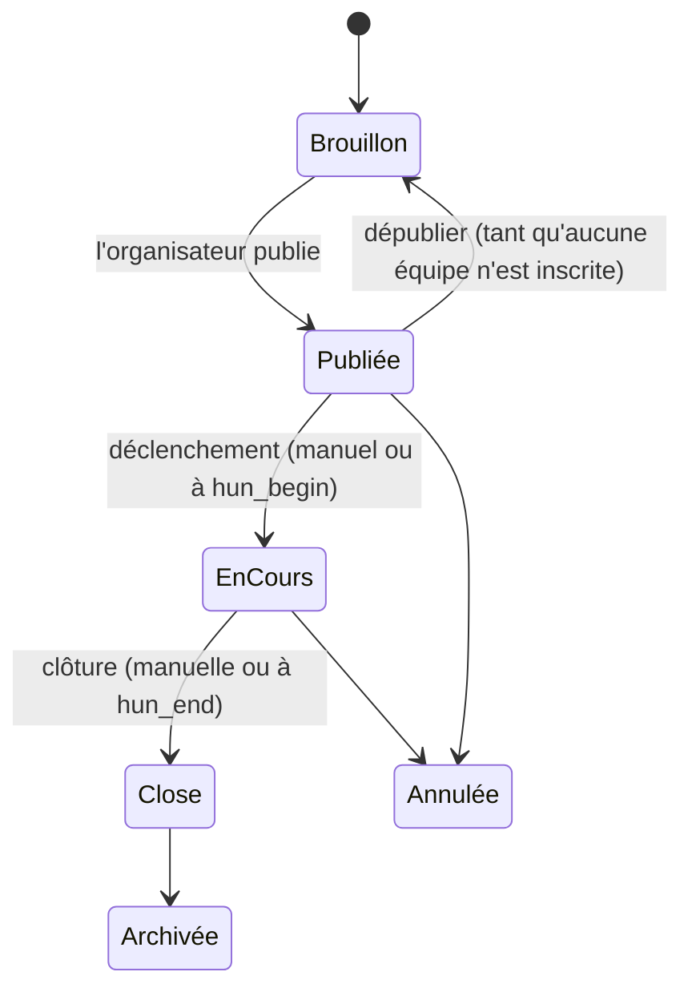
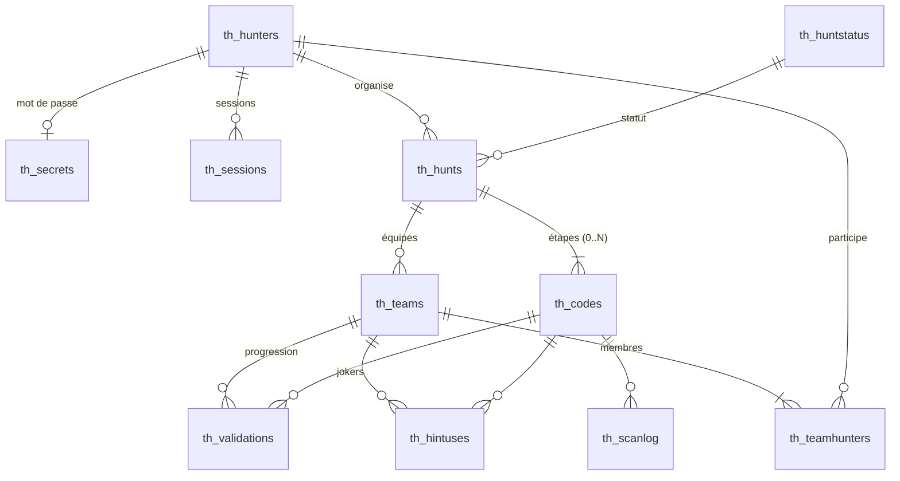

# Treasure Hunters — Document de conception

> Statut : **proposition à valider** · Version 0.1 · 24/09/2026

Ce document décrit le fonctionnement cible de l'application : le vocabulaire, les règles du jeu, le modèle de données, l'API et les écrans. Il sert de référence pour la migration SQL, le back-end et le front-end. Les points encore ouverts sont regroupés à la fin (§ 10).

---

## 1. Vocabulaire

| Terme | Définition | Table |
|---|---|---|
| **Joueur** (*hunter*) | Personne qui a un compte. Il peut organiser des chasses et participer à d'autres. | `th_hunters` |
| **Chasse** (*hunt*) | Un jeu de piste : un parcours d'étapes, une période de jeu, un mode de départ. | `th_hunts` |
| **Organisateur** | Le joueur propriétaire de la chasse (`hun_owner_htr`). | — |
| **Étape** (*code*) | Un lieu du parcours. Un QR code y est déposé. La scanner valide l'étape et révèle l'énigme de la suivante. | `th_codes` |
| **Départ** | L'étape d'ordre 0. Elle n'a pas de QR : son énigme est révélée à l'équipe à son heure de départ. | `th_codes` (ordre 0) |
| **Arrivée** | La dernière étape. La scanner arrête le chronomètre de l'équipe. | `th_codes` (ordre max) |
| **Équipe** (*team*) | Le groupe qui progresse. **Dans une chasse en solo, chaque joueur forme une équipe d'une personne.** Toutes les règles s'écrivent donc une seule fois, pour des équipes. | `th_teams` |
| **Validation** | Le fait qu'une équipe a atteint une étape, par un scan ou manuellement par l'organisateur. | `th_validations` |
| **Joker** | Un indice supplémentaire (1 à 3 par étape) que l'équipe peut dévoiler, avec une pénalité éventuelle. | `th_hintuses` |

---

## 2. Cycle de vie d'une chasse



| Statut (`th_huntstatus`) | Id | Joueurs | QR codes |
|---|---|---|---|
| Brouillon | 1 | invisible | « Cette chasse n'existe pas » |
| Publiée | 2 | visible, inscriptions ouvertes | « **Pas encore commencée** » et compte à rebours vers `hun_begin` |
| En cours | 3 | on joue | actifs, selon les règles du § 4 |
| Close | 4 | résultats | « **Terminée** » et **podium** |
| Annulée | 5 | message d'annulation | « Chasse annulée » |
| Archivée | 6 | historique uniquement | comme Close |

- `hun_begin` et `hun_end` sont les dates **prévues**. `hun_started` et `hun_closed` sont les horodatages **réels**. Ils sont posés par le bouton « Démarrer » / « Clôturer » de l'organisateur, ou automatiquement à l'heure prévue si `hun_autostart` / `hun_autoclose` vaut 1.
- La période de validité des QR va de `hun_started` à `hun_closed`, jamais au-delà.

---

## 3. Déroulement d'une partie

### 3.1 Préparation (organisateur)
1. Il crée la chasse : nom, description, lieu, dates prévues, lot, public/privé, solo/équipe (avec une taille min/max), **mode de départ** (§ 5).
2. Il saisit les étapes dans l'ordre :
   - **Départ (ordre 0)** : l'énigme qui mène à l'étape 1, et ses jokers.
   - **Étapes 1 à N-1** : un message d'arrivée (« Bravo, vous êtes à la fontaine ! »), l'énigme vers l'étape suivante, les jokers et, pour son usage à lui seulement, une position GPS.
   - **Arrivée (ordre N)** : le message final.
3. Il imprime les QR codes (une page par étape, avec son numéro et son titre) et les dépose sur place.
4. Il publie la chasse.

### 3.2 Inscription (joueurs)
- **Chasse publique** : elle apparaît dans la liste des chasses.
- **Chasse privée** : on la rejoint avec son code d'invitation (`hun_joincode`) ou un lien.
- **Chasse en équipe** : un joueur crée une équipe et devient capitaine. Il partage le code de l'équipe (`tea_joincode`) et les autres la rejoignent.
- **Chasse en solo** : l'inscription crée automatiquement une équipe d'une personne, qui porte le pseudo du joueur.
- **Un joueur ne peut être que dans une seule équipe par chasse.** C'est une contrainte de la base de données.

### 3.3 Jeu
1. **Déclenchement** : l'organisateur démarre la chasse. Chaque équipe reçoit une heure de départ (§ 5).
2. À son heure de départ, l'équipe voit l'**énigme du départ** dans l'application.
3. Arrivée sur une étape, un membre de l'équipe scanne le QR. Le scan valide l'étape pour **toute l'équipe** : les autres membres voient la progression en rafraîchissant.
4. L'énigme de l'étape suivante apparaît. Les jokers se dévoilent un par un et sont partagés par l'équipe.
5. Le scan de l'**arrivée** fixe l'heure d'arrivée de l'équipe (`tea_finished`).
6. **Clôture** : les QR deviennent inactifs et les résultats sont publiés.

---

## 4. Scanner un QR code

### 4.1 Contenu du QR
Le QR contient une URL : `https://<domaine>/q/<jeton>`.
- N'importe quel appareil photo de téléphone l'ouvre, sans passer par l'application. Le scanner intégré (bouton QR de la barre du haut) reste disponible en plus.
- Le `<jeton>` fait 22 caractères aléatoires en base62 (≈ 128 bits). **Il ne se déduit ni de l'identifiant de la chasse ni du numéro de l'étape**, donc on ne peut pas deviner le QR suivant.
- L'organisateur peut **régénérer** le jeton d'une étape (en cas de fuite, par exemple si une photo circule). Il doit alors réimprimer le QR.

### 4.2 Algorithme de validation (côté serveur)

Les tests s'appliquent dans cet ordre. Le premier qui correspond détermine la réponse.

| # | Condition | Écran affiché | Enregistré ? |
|---|---|---|---|
| 1 | Jeton inconnu, ou chasse en brouillon | « QR code inconnu » | journal |
| 2 | Chasse annulée | « Chasse annulée » | journal |
| 3 | Chasse pas encore démarrée | « **Pas encore commencée** », avec la date prévue et un compte à rebours | journal |
| 4 | Chasse close ou archivée | « **Terminée** », avec le **podium** | journal |
| 5 | Joueur non connecté | Connexion ou inscription, puis retour automatique sur ce QR | — |
| 6 | Joueur organisateur de cette chasse | « Mode organisateur » : vérification que le QR fonctionne et aperçu de l'étape | — |
| 7 | Joueur non inscrit à la chasse | Présentation de la chasse et bouton « Rejoindre » | — |
| 8 | Départ de l'équipe pas encore donné (départ échelonné) | « Votre départ est prévu à 10 h 15 » et compte à rebours | journal |
| 9 | Équipe déjà arrivée | « Vous avez terminé ! », avec le temps et le classement provisoire éventuel | journal |
| 10 | Étape déjà validée par l'équipe | Réaffichage de l'énigme suivante, sans nouvelle validation | — |
| 11 | Étape précédente pas encore validée | « **Vous avez sauté une étape** », sans révéler aucun contenu | journal |
| 12 | Sinon | **Étape validée** : message d'arrivée, puis énigme suivante (ou écran d'arrivée) | validation + journal |

- Le serveur n'envoie **jamais** au client l'énigme d'une étape qui n'est pas encore débloquée. Ce contrôle ne peut pas se faire uniquement dans le front.
- Toutes les tentatives sont écrites dans `th_scanlog`. On peut ainsi détecter les tentatives de triche et aider l'organisateur en cas de litige.
- Si un QR a été arraché ou abîmé, l'organisateur peut **valider manuellement** une étape pour une équipe depuis l'écran de pilotage. `val_source` vaut alors `MANUAL`, et `val_by_htr` enregistre qui a validé.

### 4.3 Ordre des étapes
Par défaut, les étapes sont **linéaires** : l'étape *n* n'est acceptée que si l'étape *n-1* est validée. C'est le principe du rallye, où chaque énigme mène à la suivante. Un mode « ordre libre » est envisageable plus tard (§ 10).

---

## 5. Modes de départ et classement

### 5.1 Deux modes de départ (`hun_startmode`)

| Mode | Valeur | Heure de départ de l'équipe (`tea_started`) |
|---|---|---|
| **Départ groupé** | 1 | `hun_started` pour toutes les équipes |
| **Départ échelonné** | 2 | `hun_started + (tea_startorder − 1) × hun_interval` |

- En départ échelonné, l'organisateur fixe l'**intervalle** en minutes (`hun_interval`) et l'**ordre de passage** (`tea_startorder`). Il peut ranger les équipes à la main ou lancer un tirage au sort.
- Au déclenchement, le serveur calcule et enregistre `tea_started` pour chaque équipe. Si une équipe se présente en retard, l'organisateur peut **retarder** son départ. On ne peut jamais l'avancer avant l'heure de déclenchement.

### 5.2 Une seule règle de classement

> **Temps de course = heure d'arrivée − heure de départ (+ pénalités de jokers)**
> `temps = tea_finished − tea_started + nb_jokers × hun_hintpenalty`

- En **départ groupé**, toutes les heures de départ sont égales, donc le plus petit temps correspond au **premier arrivé**. Une seule formule couvre les deux modes, et c'est celle que vous avez proposée.
- **Pénalité de joker** (`hun_hintpenalty`, en minutes, 0 par défaut) : l'organisateur choisit si les jokers coûtent du temps.
- **Égalité** : on départage par l'heure d'arrivée la plus tôt, puis par le nombre de jokers utilisés.
- **Équipes non arrivées à la clôture** : elles sont **non classées**. Elles apparaissent après les équipes classées, triées par nombre d'étapes validées (décroissant), puis par l'heure de leur dernière validation (croissante).

### 5.3 Visibilité des résultats
- Pendant la course, l'**organisateur** voit un tableau en direct : étape en cours et dernier scan de chaque équipe.
- Les **joueurs** ne voient que leur propre progression, pour garder le suspense. Un classement provisoire visible par tous est une option (§ 10).
- Après la clôture, le **podium** et le classement complet sont publics pour les participants. Ce sont eux que montre un scan de QR après la fin.

### 5.4 Exemple de requête de classement

```sql
SELECT t.tea_id, t.tea_name, t.tea_started, t.tea_finished,
       COUNT(DISTINCT v.val_id)                                        AS etapes,
       COUNT(DISTINCT h.hiu_id)                                        AS jokers,
       TIMESTAMPDIFF(SECOND, t.tea_started, t.tea_finished)
         + COUNT(DISTINCT h.hiu_id) * hu.hun_hintpenalty * 60          AS temps_s
FROM th_teams t
JOIN th_hunts hu           ON hu.hun_id = t.tea_hunt_hun
LEFT JOIN th_validations v ON v.val_team_tea = t.tea_id
LEFT JOIN th_hintuses h    ON h.hiu_team_tea = t.tea_id
WHERE t.tea_hunt_hun = ?
GROUP BY t.tea_id
ORDER BY (t.tea_finished IS NULL), temps_s, t.tea_finished, jokers,
         etapes DESC, MAX(v.val_creation);
```

---

## 6. Modèle de données

On garde les conventions de la base actuelle : préfixe `th_`, trigramme par table, clés étrangères nommées `<col>_<trigramme cible>`, colonnes `_creation` / `_lastupdate`. Le jeu de caractères devient `utf8mb4` pour accepter les emojis dans les énigmes.



### 6.1 Tables et changements par rapport à l'existant

**`th_hunters`** (joueurs) — inchangée, plus :
- `htr_email` passe à `NOT NULL` avec vérification de format ; `htr_emailverified` (datetime, nullable).

**`th_secrets`** — `sec_password` contient un **hash argon2id ou bcrypt**, jamais le mot de passe en clair. On ajoute une contrainte `UNIQUE(sec_hunter_htr)`.

**`th_sessions`** — On stocke le **hash** du jeton (SHA-256), pas le jeton lui-même. On ajoute `ses_expires`, `ses_useragent` et un index sur `ses_hunter_htr`. Chaque connexion génère un jeton aléatoire différent.

**`th_huntstatus`** — On l'alimente avec les 6 statuts du § 2.

**`th_hunts`** (chasses)

| Colonne | Type | Changement | Rôle |
|---|---|---|---|
| `hun_begin` / `hun_end` | datetime | — | dates prévues |
| `hun_started` / `hun_closed` | datetime NULL | **nouveau** | horodatages réels du déclenchement et de la clôture |
| `hun_autostart` / `hun_autoclose` | tinyint | **nouveau** | déclenchement et clôture automatiques à l'heure prévue |
| `hun_startmode` | tinyint | **nouveau**, remplace `hun_mode` | 1 = groupé, 2 = échelonné |
| `hun_interval` | smallint NULL | **nouveau** | minutes entre deux départs (mode échelonné) |
| `hun_hintpenalty` | smallint | **nouveau**, défaut 0 | minutes de pénalité par joker |
| `hun_teamgame` | tinyint | — | 0 = solo, 1 = équipes |
| `hun_teammin` / `hun_teammax` | tinyint | **nouveau** | taille des équipes |
| `hun_joincode` | varchar(12) | **nouveau**, UNIQUE | code d'invitation d'une chasse privée |
| `hun_contribution` | decimal(10,2) | **type corrigé** | participation demandée (affichage seul, pas de paiement en ligne) |
| `hun_starttext` | text NULL | **nouveau** | consignes générales affichées avant le départ |
| `hun_longid` | — | **supprimé** | l'URL publique passe par l'id ou le code d'invitation |

**`th_codes`** (étapes)

| Colonne | Type | Changement | Rôle |
|---|---|---|---|
| `cod_order` | int | — | 0 = départ, 1..N ; UNIQUE(hunt, order) |
| `cod_longid` | varchar(32) NULL | **devient un jeton aléatoire** | contenu du QR ; NULL pour le départ |
| `cod_title` | varchar(255) | — | nom du lieu, visible par l'organisateur et affiché après le scan |
| `cod_arrival` | text NULL | **nouveau** | message affiché au scan (« Bravo, vous êtes à la fontaine ! ») |
| `cod_instructions` | text NULL | nullable | **énigme menant à l'étape suivante** ; NULL pour l'arrivée |
| `cod_hint1..3` | text NULL | — | jokers de cette énigme |
| `cod_answer` | varchar(255) NULL | **nouveau**, optionnel | réponse attendue avant d'afficher la suite (§ 10) |
| `cod_latitude` / `cod_longitude` | decimal(9,6) NULL | **nouveau** | position (organisateur seulement) |
| `cod_address` | varchar(255) NULL | **nouveau** | adresse ou repère (organisateur seulement) |

**`th_teams`** (équipes)

| Colonne | Type | Changement | Rôle |
|---|---|---|---|
| `tea_owner_htr` | int | — | capitaine |
| `tea_joincode` | varchar(12) | **nouveau**, UNIQUE | code pour rejoindre l'équipe |
| `tea_solo` | tinyint | **nouveau** | 1 = équipe implicite d'une chasse en solo |
| `tea_startorder` | smallint NULL | **nouveau** | ordre de passage (départ échelonné) |
| `tea_started` | datetime NULL | **nouveau** | heure de départ réelle |
| `tea_finished` | datetime NULL | **nouveau** | heure d'arrivée (scan de la dernière étape) |
| — | — | **clé** | UNIQUE(`tea_hunt_hun`, `tea_name`) et UNIQUE(`tea_id`, `tea_hunt_hun`), cette dernière pour la clé composite ci-dessous |

**`th_teamhunters`** (membres)
- **Nouveau** : `thr_hunt_hun`, copie de la chasse de l'équipe, avec la contrainte **UNIQUE(`thr_hunt_hun`, `thr_hunter_htr`)** : un joueur appartient à une seule équipe par chasse.
- Une clé étrangère composite (`thr_team_tea`, `thr_hunt_hun`) → `th_teams(tea_id, tea_hunt_hun)` garantit que cette copie reste cohérente.

**`th_validations`** (nouvelle ; remplace `th_huntercodes` pour la progression)

| Colonne | Rôle |
|---|---|
| `val_team_tea` | l'équipe qui progresse |
| `val_code_cod` | l'étape validée |
| `val_hunter_htr` | le membre qui a scanné |
| `val_source` | `QR` ou `MANUAL` |
| `val_by_htr` | l'organisateur qui a validé manuellement (remplace `htc_giftedby_htr`) |
| `val_creation` | **heure de passage**, qui sert au chrono |
| — | UNIQUE(`val_team_tea`, `val_code_cod`) |

**`th_hintuses`** (nouvelle ; remplace `htc_hint1..3`) : `hiu_team_tea`, `hiu_code_cod`, `hiu_level` (1 à 3), `hiu_hunter_htr`, `hiu_creation`, avec UNIQUE(team, code, level). Le joker *n* ne peut être dévoilé que si le joker *n-1* l'a déjà été.

**`th_scanlog`** (nouvelle) : `scl_code_cod` (nullable si le jeton est inconnu), `scl_token`, `scl_hunter_htr` (nullable), `scl_team_tea` (nullable), `scl_result` (le code de résultat du § 4.2), `scl_ip`, `scl_creation`.

**`th_huntercodes`** — On migre ses données vers `th_validations` et `th_hintuses`, puis on la supprime.

---

## 7. API REST (esquisse)

Préfixe `/api`. Authentification par `Authorization: Bearer <jeton>`. Les réponses sont en JSON avec des noms de champs en camelCase : le back-end traduit `hun_begin` en `begin`, etc.

| Méthode & chemin | Rôle | Accès |
|---|---|---|
| `POST /auth/register` · `POST /auth/login` · `POST /auth/logout` | comptes et sessions | public / connecté |
| `GET /me` · `PATCH /me` · `PATCH /me/password` | profil | connecté |
| `GET /hunts?scope=public\|mine\|playing` | listes de chasses | public / connecté |
| `GET /hunts/:id` | détail (sans le contenu des étapes) | selon visibilité |
| `POST /hunts` · `PATCH /hunts/:id` · `DELETE /hunts/:id` | gestion | organisateur |
| `POST /hunts/:id/publish` · `/start` · `/close` · `/cancel` | cycle de vie | organisateur |
| `GET /hunts/:id/codes` · `POST` · `PATCH /codes/:id` · `DELETE` · `POST /hunts/:id/codes/reorder` | étapes | organisateur |
| `POST /codes/:id/regenerate` | nouveau jeton QR | organisateur |
| `GET /hunts/:id/teams` · `POST /hunts/:id/teams` | équipes | inscrit / connecté |
| `POST /hunts/join` `{code}` · `POST /teams/join` `{code}` · `DELETE /teams/:id/members/me` | inscription | connecté |
| `PATCH /hunts/:id/teams/order` · `PATCH /teams/:id/start` | ordre de passage, décalage d'un départ | organisateur |
| `GET /hunts/:id/play` | état de jeu de **mon** équipe : étapes validées, énigme courante, jokers dévoilés | membre |
| `GET /q/:token` | **scan** : applique le § 4.2 et renvoie `{result, hunt, step?, next?, podium?}` | public (plus de détails si connecté) |
| `POST /hunts/:id/hints` `{codeId, level}` | dévoiler un joker | membre |
| `GET /hunts/:id/live` | tableau de bord en direct | organisateur |
| `POST /teams/:id/validations` `{codeId}` | validation manuelle | organisateur |
| `GET /hunts/:id/results` | classement (§ 5.2) | organisateur ; tous après la clôture |

---

## 8. Écrans

| # | Écran | Route | Qui |
|---|---|---|---|
| E1 | Accueil : chasses publiques, mes chasses, bouton « Scanner » | `/` | tous |
| E2 | Connexion / inscription | `/login`, `/register` | public |
| E3 | Détail d'une chasse et inscription (créer ou rejoindre une équipe) | `/hunts/:id` | tous |
| E4 | **Jeu** : chrono, énigme courante, jokers, étapes validées | `/play/:huntId` | membre |
| E5 | **Résultat de scan** : les états du § 4.2 | `/q/:token` | tous |
| E6 | **Résultats et podium** | `/hunts/:id/results` | selon § 5.3 |
| E7 | Scanner intégré (caméra) | `/scan` | tous |
| E8 | Mes chasses organisées | `/organize` | organisateur |
| E9 | Éditeur de chasse : infos, règles, mode de départ | `/organize/:id` | organisateur |
| E10 | Éditeur d'étapes : liste réordonnable, contenu, jokers, aperçu | `/organize/:id/steps` | organisateur |
| E11 | Planche de QR imprimable | `/organize/:id/qrcodes` | organisateur |
| E12 | **Pilotage en direct** : démarrer, clôturer, ordre de passage, progression des équipes, validation manuelle | `/organize/:id/live` | organisateur |
| E13 | Profil | `/me` | connecté |

---

## 9. Choix techniques

- **Front** : on passe d'Angular 16, qui n'est plus maintenu, à **Angular 22** avec des composants autonomes (*standalone*), les *signals* et Material 3. L'application reste une **PWA**, installable et avec l'écran allumé pendant le jeu. `@angular/flex-layout`, abandonné, est remplacé par du CSS grid/flex. Les maquettes (étape B) utilisent un service de données fictives, remplacé par l'API à l'étape B finale.
- **QR codes** : génération avec `angularx-qrcode` côté front pour la planche imprimable. La lecture se fait par l'URL, qu'ouvre l'appareil photo natif, et éventuellement avec `@zxing/ngx-scanner` dans l'application.
- **Heures** : le serveur stocke tout en **UTC**. Le front affiche l'heure locale. Le chrono se calcule sur l'heure du serveur, jamais sur celle du téléphone.
- **Back-end** : à décider (§ 10).
- **Sécurité** :
  - les mots de passe sont hashés ;
  - les jetons de session sont aléatoires, stockés hashés et expirent ;
  - le nombre de scans est limité (*rate limiting*) par IP et par joueur ;
  - les contrôles d'accès se font toujours côté serveur ;
  - la position des étapes n'est jamais exposée aux joueurs.

---

## 10. Questions ouvertes

1. **Back-end** : lequel choisir ?
   - PHP, dans la continuité du serveur `crealcs.com`, mais à moderniser : PHP 8.3 et un framework léger ;
   - Node/TypeScript (NestJS ou Fastify), qui partagerait les types avec Angular. **C'est ma recommandation** ;
   - un service géré comme Supabase.
2. **Ordre des étapes** : le mode linéaire suffit-il, ou faut-il aussi un mode « ordre libre » où l'on doit toutes les trouver dans n'importe quel ordre ?
3. **Énigme à réponse** : faut-il pouvoir exiger une réponse saisie (`cod_answer`) avant de montrer le message d'arrivée ou l'énigme suivante ?
4. **Pénalité des jokers** : faut-il une valeur par chasse (proposée ici) ou une valeur différente par niveau de joker ?
5. **Classement provisoire** : doit-il être visible par les joueurs pendant la course ?
6. **`htc_giftedby_htr`** : quelle était l'intention (étape « offerte » par l'organisateur ? par un autre joueur ?) ? La proposition actuelle la remplace par la validation manuelle par l'organisateur.
7. **`hun_contribution`** : un simple affichage, ou faudra-t-il un jour un paiement en ligne ?
