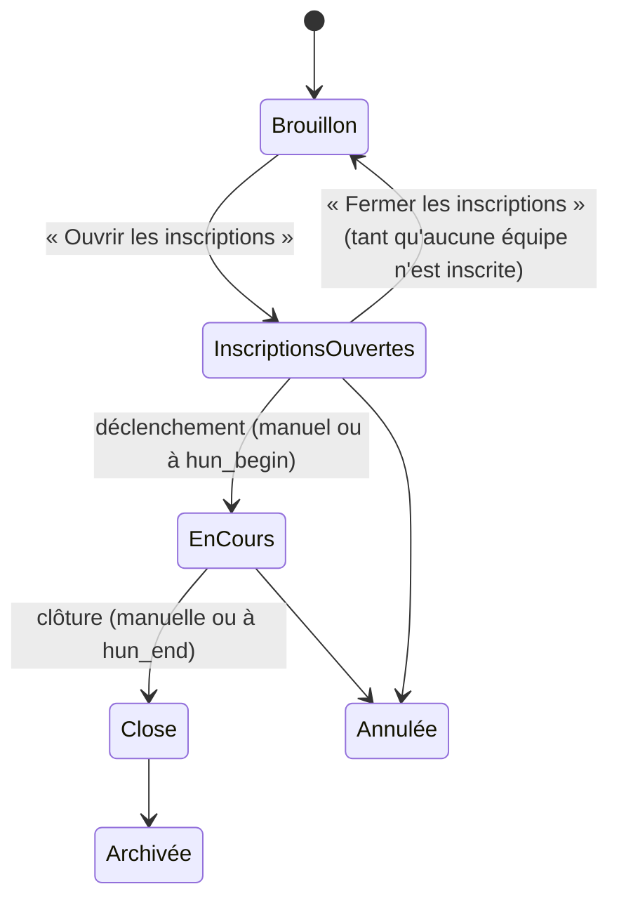
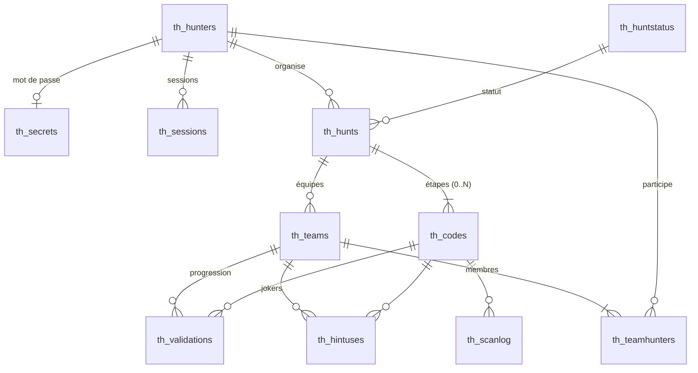

# SecretTracks — Document de conception

> Statut : **validé** · Version 0.2 · 24/09/2026 — décisions intégrées, base PostgreSQL

Ce document décrit le fonctionnement cible de l'application : le vocabulaire, les règles du jeu, le modèle de données, l'API et les écrans. Il sert de référence pour le schéma SQL (`db/`), le back-end (`server/`) et le front-end (`src/`). Les décisions prises et les évolutions envisagées sont regroupées à la fin (§ 10).

---

## 1. Vocabulaire

| Terme | Définition | Table |
|---|---|---|
| **Joueur** (*hunter*) | Personne qui a un compte. Il peut organiser des chasses et participer à d'autres. | `th_hunters` |
| **Chasse** (*hunt*) | Un jeu de piste : un parcours d'étapes, une période de jeu, un mode de départ. | `th_hunts` |
| **Organisateur** | Le joueur propriétaire de la chasse (`hun_owner_htr`). | — |
| **Étape** (*code*) | Un lieu du parcours. Un QR code y est déposé. La scanner valide l'étape et révèle l'énigme de la suivante. | `th_codes` |
| **Départ** | L'étape d'ordre 0. Elle n'a pas de QR : son énigme est révélée à l'équipe à son heure de départ. | `th_codes` (ordre 0) |
| **Arrivée** | La dernière étape. La scanner arrête le chronomètre de l'équipe. | `th_codes` (ordre max) |
| **Équipe** (*team*) | Le groupe qui progresse. **Dans une chasse en solo, chaque joueur forme une équipe d'une personne.** Toutes les règles s'écrivent donc une seule fois, pour des équipes. | `th_teams` |
| **Validation** | Le fait qu'une équipe a atteint une étape, par un scan ou manuellement par l'organisateur. | `th_validations` |
| **Joker** | Un indice supplémentaire (1 à 3 par énigme) que l'équipe peut dévoiler, avec une pénalité en minutes qui dépend de son niveau. | `th_hintuses` |
| **Abandon** (« 4ᵉ joker ») | L'équipe renonce au lieu qu'elle cherche et passe directement à l'énigme suivante, moyennant une pénalité de temps. Abandonner l'arrivée (le trésor) termine le parcours : l'équipe est classée après celles qui l'ont trouvé. | `th_validations` (source `SKIP`) |
| **Abandon de la partie** | Toute l'équipe renonce : le chrono s'arrête, plus aucune énigme ne s'affiche, l'équipe n'est pas classée. | `th_teams.tea_abandoned` |

---

## 2. Cycle de vie d'une chasse

```mermaid
stateDiagram-v2
    [*] --> Brouillon
    Brouillon --> InscriptionsOuvertes : « Ouvrir les inscriptions »
    InscriptionsOuvertes --> Brouillon : « Fermer les inscriptions » (tant qu'aucune équipe n'est inscrite)
    InscriptionsOuvertes --> EnCours : déclenchement (manuel ou à hun_begin)
    EnCours --> Close : clôture (manuelle ou à hun_end)
    InscriptionsOuvertes --> Annulée
    EnCours --> Annulée
    Close --> Archivée
```

| Statut (`th_huntstatus`) | Id | Joueurs | QR codes |
|---|---|---|---|
| Brouillon | 1 | invisible | « Cette chasse n'existe pas » |
| Inscriptions ouvertes (`published`) | 2 | visible, inscriptions ouvertes | « **Pas encore commencée** » et compte à rebours vers `hun_begin` |
| En cours | 3 | on joue | actifs, selon les règles du § 4 |
| Close | 4 | résultats | « **Terminée** » et **podium** |

> **Vocabulaire** : pour une chasse, on **ouvre les inscriptions** (brouillon → inscriptions ouvertes) ; « publier » n'est pas employé, pour ne pas confondre avec le **partage au catalogue** (§ 13), qui expose une copie du parcours aux autres organisateurs. Les deux gestes sont indépendants.
| Annulée | 5 | message d'annulation | « Chasse annulée » |
| Archivée | 6 | historique uniquement | comme Close |

- `hun_begin` et `hun_end` sont les dates **prévues**. `hun_started` et `hun_closed` sont les horodatages **réels**. Ils sont posés par le bouton « Démarrer » / « Clôturer » de l'organisateur, ou automatiquement à l'heure prévue si `hun_autostart` / `hun_autoclose` vaut 1.
- La période de validité des QR va de `hun_started` à `hun_closed`, jamais au-delà.

---

## 3. Déroulement d'une partie

### 3.1 Préparation (organisateur)
1. Il crée la chasse : nom, description, lieu, dates prévues, lot, public/privé, solo/équipe (avec une taille min/max), **mode de départ** (§ 5).
2. Il saisit les étapes dans l'ordre :
   - **Départ (ordre 0)** : l'énigme qui mène à l'étape 1, et ses jokers.
   - **Étapes 1 à N-1** : un message d'arrivée (« Bravo, vous êtes à la fontaine ! »), l'énigme vers l'étape suivante, les jokers et, pour son usage à lui seulement, une position GPS.
   - **Arrivée (ordre N)** : le message final.
3. Il imprime les QR codes (une page par étape, avec son numéro et son titre) et les dépose sur place.
4. Il publie la chasse.

### 3.2 Inscription (joueurs)
- **Chasse publique** : elle apparaît dans la liste des chasses.
- **Chasse privée** : on la rejoint avec son code d'invitation (`hun_joincode`) ou un lien.
- **Chasse en équipe** : un joueur crée une équipe et devient capitaine. Il partage le code de l'équipe (`tea_joincode`) et les autres la rejoignent.
- **Chasse en solo** : l'inscription crée automatiquement une équipe d'une personne, qui porte le pseudo du joueur.
- **Un joueur ne peut être que dans une seule équipe par chasse.** C'est une contrainte de la base de données.

### 3.3 Jeu
1. **Déclenchement** : l'organisateur démarre la chasse. Chaque équipe reçoit une heure de départ (§ 5).
2. À son heure de départ, l'équipe voit l'**énigme du départ** dans l'application.
3. Arrivée sur une étape, un membre de l'équipe scanne le QR. Le scan valide l'étape pour **toute l'équipe** : les autres membres voient la progression en rafraîchissant.
4. L'énigme de l'étape suivante apparaît. Les jokers se dévoilent un par un et sont partagés par l'équipe.
5. Le scan de l'**arrivée** fixe l'heure d'arrivée de l'équipe (`tea_finished`).
6. **Clôture** : les QR deviennent inactifs et les résultats sont publiés.

---

## 4. Scanner un QR code

### 4.1 Contenu du QR
Le QR contient une URL : `https://<domaine>/q/<jeton>`.
- N'importe quel appareil photo de téléphone l'ouvre, sans passer par l'application. Le scanner intégré (bouton QR de la barre du haut) reste disponible en plus.
- Le `<jeton>` fait 22 caractères aléatoires en base62 (≈ 128 bits). **Il ne se déduit ni de l'identifiant de la chasse ni du numéro de l'étape**, donc on ne peut pas deviner le QR suivant.
- L'organisateur peut **régénérer** le jeton d'une étape (en cas de fuite, par exemple si une photo circule). Il doit alors réimprimer le QR.

### 4.2 Algorithme de validation (côté serveur)

Les tests s'appliquent dans cet ordre. Le premier qui correspond détermine la réponse.

| # | Condition | Écran affiché | Enregistré ? |
|---|---|---|---|
| 1 | Jeton inconnu, ou chasse en brouillon | « QR code inconnu » | journal |
| 2 | Chasse annulée | « Chasse annulée » | journal |
| 3 | Chasse pas encore démarrée | « **Pas encore commencée** », avec la date prévue et un compte à rebours | journal |
| 4 | Chasse close ou archivée | « **Terminée** », avec le **podium** | journal |
| 5 | Joueur non connecté | Connexion ou inscription, puis retour automatique sur ce QR | — |
| 6 | Joueur organisateur de cette chasse | « Mode organisateur » : vérification que le QR fonctionne et aperçu de l'étape | — |
| 7 | Joueur non inscrit à la chasse | Présentation de la chasse et bouton « Rejoindre » | — |
| 8 | Départ de l'équipe pas encore donné (départ échelonné) | « Votre départ est prévu à 10 h 15 » et compte à rebours | journal |
| 9 | Équipe déjà arrivée | « Vous avez terminé ! », avec le temps et le classement provisoire éventuel | journal |
| 10 | Étape déjà validée par l'équipe | Réaffichage de l'énigme suivante, sans nouvelle validation | — |
| 11 | Étape précédente pas encore validée | « **Vous avez sauté une étape** », sans révéler aucun contenu | journal |
| 12 | Sinon | **Étape validée** : message d'arrivée, puis énigme suivante (ou écran d'arrivée) | validation + journal |

- Le serveur n'envoie **jamais** au client l'énigme d'une étape qui n'est pas encore débloquée. Ce contrôle ne peut pas se faire uniquement dans le front.
- Toutes les tentatives sont écrites dans `th_scanlog`. On peut ainsi détecter les tentatives de triche et aider l'organisateur en cas de litige.
- Si un QR a été arraché ou abîmé, l'organisateur peut **valider manuellement** une étape pour une équipe depuis l'écran de pilotage. `val_source` vaut alors `MANUAL`, et `val_by_htr` enregistre qui a validé. L'équipe peut aussi envoyer une **photo du lieu** à la place du QR (§ 12).

### 4.3 Ordre des étapes
Par défaut, les étapes sont **linéaires** : l'étape *n* n'est acceptée que si l'étape *n-1* est validée. C'est le principe du rallye, où chaque énigme mène à la suivante. Un mode « ordre libre » est envisageable plus tard (§ 10).

---

## 5. Modes de départ et classement

### 5.1 Deux modes de départ (`hun_startmode`)

| Mode | Valeur | Heure de départ de l'équipe (`tea_started`) |
|---|---|---|
| **Départ groupé** | 1 | `hun_started` pour toutes les équipes |
| **Départ échelonné** | 2 | `hun_started + (tea_startorder − 1) × hun_interval` |

- En départ échelonné, l'organisateur fixe l'**intervalle** en minutes (`hun_interval`) et l'**ordre de passage** (`tea_startorder`). Il peut ranger les équipes à la main ou lancer un tirage au sort.
- Au déclenchement, le serveur calcule et enregistre `tea_started` pour chaque équipe. Si une équipe se présente en retard, l'organisateur peut **retarder** son départ. On ne peut jamais l'avancer avant l'heure de déclenchement.

### 5.2 Une seule règle de classement

> **Temps de course = heure d'arrivée − heure de départ + pénalités (jokers et abandons)**
> `temps = tea_finished − tea_started + Σ pénalité(niveau du joker) + nb_abandons × hun_skippenalty`

- En **départ groupé**, toutes les heures de départ sont égales, donc le plus petit temps correspond au **premier arrivé**. Une seule formule couvre les deux modes.
- **Pénalités de jokers, par niveau** (`hun_penalty1`, `hun_penalty2`, `hun_penalty3`, en minutes, 0 par défaut). Exemple : joker 1 = +2 min, joker 2 = +5 min, joker 3 = +10 min. Les jokers d'une énigme se dévoilent dans l'ordre, donc le joker 2 n'est accessible qu'après le 1.
- **Abandon d'une épreuve** (`hun_skippenalty`, en minutes, 30 par défaut) : une équipe bloquée peut renoncer au lieu qu'elle cherche. L'étape est enregistrée comme validation de source `SKIP`, sans QR, et l'énigme suivante s'affiche aussitôt. Le QR de l'étape abandonnée, s'il est trouvé plus tard, n'apporte plus rien (« déjà validée »). **Abandonner l'arrivée** (« Abandonner le trésor ») termine le parcours : le chrono s'arrête, la pénalité s'ajoute, et l'équipe est **classée après toutes celles qui ont trouvé le trésor** (puis entre elles au temps). Elle est repérée sans colonne dédiée : l'arrivée est toujours la dernière étape validée, donc une équipe arrivée dont la dernière validation est un `SKIP` a abandonné le trésor (`treasureSkipped` dans le classement). L'abandon est confirmé à part et se sérialise avec les scans de l'équipe.
- **Abandon de la partie** (`POST /hunts/:id/abandon`, depuis l'accueil ou le carnet de route) : un membre renonce **pour toute l'équipe**, après confirmation, une fois la partie commencée (avant, on quitte simplement la Secret Track). `tea_abandoned` et `tea_abandoned_by` sont renseignés (migration `031_abandon.sql`) : plus d'énigme, de joker, d'abandon ni de validation (un scan répond `team_abandoned`, l'organisateur ne peut plus valider à la main), la partie quitte « Ma partie en cours », l'équipe apparaît « abandon » dans le direct et ferme la marche du classement, non classée. Une chasse surprise se clôt quand toutes ses équipes sont arrivées ou ont abandonné.
- **Égalité** : on départage par l'heure d'arrivée la plus tôt, puis par le nombre de jokers et d'abandons.
- **Équipes non arrivées à la clôture** : elles sont **non classées** et apparaissent après les équipes classées. On les trie par nombre d'étapes validées (décroissant), puis par le temps écoulé entre leur départ et leur dernière validation (croissant). Ce critère reste juste en départ échelonné.

### 5.3 Visibilité des résultats
- Pendant la course, l'**organisateur** voit le tableau de pilotage en direct et le classement provisoire complet.
- Chaque **joueur** voit uniquement la **position provisoire de sa propre équipe** (« 4ᵉ / 6 »), jamais celle des autres. Cette position est calculée avec les mêmes règles que le classement final.
- Après la clôture, le **podium** et le classement complet sont publics. Ce sont eux que montre un scan de QR après la fin.

### 5.4 Où sont codées ces règles

Les règles du jeu (§ 4.2 et § 5) sont écrites **une seule fois**, en TypeScript, dans `shared/rules.ts` : `evaluateScan`, `teamStartTimes`, `computeRanking`, `teamPosition`, `hintPenaltyMinutes`, `penaltyMinutes`. Elles sont couvertes par `shared/rules.spec.ts` et utilisées à la fois par le serveur et par le back-end simulé des maquettes.

---

## 6. Modèle de données (PostgreSQL)

Le schéma est dans `db/migrations/001_initial.sql`. Le serveur l'applique au démarrage, ou via `npm run migrate`, et note les scripts appliqués dans `th_migrations`. On garde les conventions de la première version :
- préfixe `th_` et trigramme par table ;
- clés étrangères nommées `<col>_<trigramme cible>` ;
- colonnes `_creation` / `_lastupdate`.

Les dates sont en `timestamptz` (UTC). Les clés primaires sont des colonnes `GENERATED ALWAYS AS IDENTITY` et les booléens de vrais `boolean`. Des contraintes `CHECK` protègent les règles simples : dates cohérentes, taille d'équipe, niveau de joker de 1 à 3, etc.

```mermaid
erDiagram
    th_hunters ||--o| th_secrets : "mot de passe"
    th_hunters ||--o{ th_sessions : "sessions"
    th_hunters ||--o{ th_hunts : "organise"
    th_huntstatus ||--o{ th_hunts : "statut"
    th_hunts ||--|{ th_codes : "étapes (0..N)"
    th_hunts ||--o{ th_teams : "équipes"
    th_teams ||--|{ th_teamhunters : "membres"
    th_hunters ||--o{ th_teamhunters : "participe"
    th_teams ||--o{ th_validations : "progression"
    th_codes ||--o{ th_validations : ""
    th_teams ||--o{ th_hintuses : "jokers"
    th_codes ||--o{ th_hintuses : ""
    th_codes ||--o{ th_scanlog : ""
```

### 6.1 Tables et différences avec la base MariaDB d'origine

**`th_hunters`** (joueurs)
- Le pseudo et l'e-mail sont uniques sans tenir compte de la casse (index sur `lower(...)`).
- L'e-mail est vérifié par une expression régulière.
- Nouvelle colonne `htr_emailverified`.

**`th_secrets`** — `sec_password` contient un **hash argon2id**. Il y a au plus un secret par joueur.

**`th_sessions`**
- On ne stocke que `ses_tokenhash`, le SHA-256 du jeton aléatoire remis au client, jamais le jeton lui-même.
- `ses_expires` : 30 jours par défaut.
- `ses_useragent` enregistre le navigateur utilisé.

**`th_huntstatus`** — 6 statuts, avec un `hst_code` (`draft`, `published`, `running`, `closed`, `cancelled`, `archived`) exposé par l'API.

**`th_hunts`** (chasses)

| Colonne | Type | Rôle |
|---|---|---|
| `hun_begin` / `hun_end` | timestamptz | dates prévues, avec `hun_end > hun_begin` |
| `hun_started` / `hun_closed` | timestamptz NULL | horodatages réels du déclenchement et de la clôture |
| `hun_autostart` / `hun_autoclose` | boolean | déclenchement et clôture automatiques ; le serveur vérifie toutes les 30 s |
| `hun_startmode` | smallint | 1 = groupé, 2 = échelonné (remplace `hun_mode`) |
| `hun_interval` | smallint NULL | minutes entre deux départs, obligatoire en mode échelonné |
| `hun_penalty1..3` | smallint | minutes de pénalité par niveau de joker |
| `hun_skippenalty` | smallint | minutes de pénalité par épreuve abandonnée (migration 002) |
| `hun_teamgame`, `hun_teammin`, `hun_teammax` | boolean, smallint | solo ou équipes, et taille des équipes |
| `hun_public`, `hun_joincode` | boolean, varchar(12) UNIQUE | visibilité et code d'invitation |
| `hun_contribution` | numeric(10,2) | participation, affichée seulement |
| `hun_starttext`, `hun_award` | text | consignes de départ, trésor |

**`th_codes`** (étapes)
- `cod_order` : 0 = départ, puis 1..N. La contrainte UNIQUE(chasse, ordre) est *différable*, pour pouvoir réordonner les étapes dans une transaction.
- `cod_longid` : jeton aléatoire du QR code, NULL seulement pour le départ (contrainte `ck_cod_token`).
- `cod_arrival` : message affiché au scan. `cod_instructions` : énigme vers l'étape suivante. `cod_hint1..3` : les jokers.
- `cod_latitude`, `cod_longitude`, `cod_address` : position, visible par l'organisateur seulement.
- `cod_answer` : réservé aux énigmes à réponse (§ 10.2).

**`th_teams`** (équipes)
- `tea_joincode` UNIQUE, `tea_solo`, `tea_startorder`, `tea_started`, `tea_finished`.
- UNIQUE(chasse, nom).
- UNIQUE(`tea_id`, `tea_hunt_hun`) sert de cible à la clé composite de `th_teamhunters`.

**`th_teamhunters`** (membres)
- `thr_hunt_hun` est une copie de la chasse, gardée cohérente par la clé étrangère composite (`thr_team_tea`, `thr_hunt_hun`).
- La contrainte **UNIQUE(`thr_hunt_hun`, `thr_hunter_htr`)** garantit qu'un joueur n'est que dans **une seule équipe par chasse**.

**`th_validations`** (remplace `th_huntercodes` pour la progression)
- `val_team_tea`, `val_code_cod` et `val_hunter_htr`, le membre qui a scanné.
- `val_source` vaut `QR`, `MANUAL`, `SKIP` (épreuve abandonnée par l'équipe) `GEO` (arrivée validée par géolocalisation, § 11.3) ou `PHOTO` (photo du lieu à la place du QR, § 12). `val_by_htr` n'est rempli que pour une validation manuelle par l'organisateur ; il remplace `htc_giftedby_htr`.
- `val_creation` est l'**heure de passage**.
- UNIQUE(équipe, étape).

**`th_hintuses`** (remplace `htc_hint1..3`) : l'équipe, l'étape, le niveau (1 à 3), le joueur qui a ouvert le joker et l'heure. UNIQUE(équipe, étape, niveau).

**`th_scanlog`** : toutes les tentatives de scan, avec le jeton, le joueur, l'équipe, le résultat (§ 4.2) et l'adresse IP.

### 6.2 Concurrence
Deux équipiers peuvent scanner le même QR au même instant. Le serveur **verrouille la ligne de l'équipe** (`SELECT … FOR UPDATE`) pendant l'évaluation du scan : un seul des deux valide l'étape, l'autre obtient « déjà validée ». L'ouverture d'un joker, l'arrivée d'un équipier et le déclenchement sont protégés de la même façon.

---

## 7. API REST

Serveur : `server/src/app.ts`. Préfixe `/api`, JSON, noms de champs en camelCase, types dans `shared/models.ts`.
- **Authentification** : `Authorization: Bearer <jeton>`.
- **Erreurs** : `{ message }` avec le statut 400, 401, 403, 404, 409 ou 429.
- **Limitation du nombre de requêtes** : sur la connexion, l'inscription, l'arrivée dans une équipe et les scans.

| Méthode & chemin | Rôle | Accès |
|---|---|---|
| `POST /auth/register` · `POST /auth/login` | création de compte et connexion → `{ user, token }` | public |
| `POST /auth/logout` · `GET /me` · `PATCH /me` | session et profil | connecté |
| `GET /hunts?scope=public\|playing\|organized` | listes de chasses | public / connecté |
| `GET /hunts/:id` · `GET /hunts/by-code/:code` | détail, recherche par code d'invitation (chasse ou équipe) | selon visibilité |
| `POST /hunts` · `PATCH /hunts/:id` | création et modification ; les règles sont figées une fois la course lancée | organisateur |
| `POST /hunts/:id/publish\|unpublish\|start\|close\|cancel` | cycle de vie | organisateur |
| `GET /hunts/:id/steps` · `POST /hunts/:id/steps` · `PUT /hunts/:id/steps/order` | parcours | organisateur |
| `PATCH /steps/:id` · `DELETE /steps/:id` · `POST /steps/:id/regenerate` | une étape, nouveau jeton QR | organisateur |
| `GET /hunts/:id/teams` · `POST /hunts/:id/teams` · `POST /hunts/:id/solo` | équipes, inscription | connecté |
| `GET /hunts/:id/my-team` · `DELETE /hunts/:id/my-team` · `POST /teams/join` | mon équipe, quitter, rejoindre par code | connecté |
| `PUT /hunts/:id/teams/order` · `POST /teams/:id/delay` | ordre de passage, décalage d'un départ | organisateur |
| `GET /hunts/:id/play` · `POST /hunts/:id/hints` · `POST /hunts/:id/skip` · `POST /hunts/:id/abandon` | carnet de route de mon équipe (avec sa position provisoire), joker suivant, abandon de l'épreuve en cours (y compris le trésor), abandon de la partie par toute l'équipe | membre |
| `POST /hunts/:id/checkin` · `POST /hunts/:id/self-start` | « Je suis arrivé » (validation par géolocalisation, § 11.3), départ d'une chasse surprise | membre |
| `PUT /hunts/:id/self-paced` | chasse surprise : « chacun son chrono » ou départ commun (§ 11.4) | hôte |
| `POST /hunts/:id/photos` · `POST /photos/:id/insist` · `GET /photos/:id/image` | preuve par photo : envoi jugé par l'IA, insistance de l'équipe, image (§ 12) | membre (image : membre ou organisateur) |
| `GET /hunts/:id/photos` · `POST /photos/:id/review` | photos de la chasse, contrôle (tamponner ou refuser) | organisateur |
| `GET\|PUT\|DELETE /steps/:id/reference-photo` | photo de référence d'une étape | organisateur |
| `GET /steps/:id/illustration` | photo du lieu montrée aux joueurs (§ 18) | organisateur, équipe à qui elle est montrée |
| `GET /features` | fonctions activées sur le serveur (photos, génération) | public |
| `GET /catalog?q=&sort=rating\|plays\|recent` · `GET /catalog/:id` | catalogue et fiche d'une version (§ 13) | public |
| `GET /catalog?mine=1` · `GET /catalog?hunt=:id` | mes publications, celles d'une de mes chasses (retirées comprises) | connecté |
| `POST /hunts/:id/catalog` · `DELETE /catalog/:id` | publier une version, la retirer | auteur |
| `POST /catalog/:id/copy` | créer un brouillon à partir d'une version | connecté |
| `GET\|PUT /hunts/:id/rating` · `GET /organizers/:id` | avis d'un joueur sur une chasse close, fiche d'organisateur (§ 14) | joueur / public |
| `POST /hunts/generate` · `GET /generations/:id` | invention d'une chasse (§ 11), suivi de la génération | connecté |
| `POST /scan/:token` | **scan** : § 4.2, journalisé. En POST, parce qu'un scan peut valider une étape | public (plus de détails si connecté) |
| `GET /hunts/:id/results` | classement : l'organisateur pendant la course, tout le monde après la clôture | selon § 5.3 |
| `GET /hunts/:id/live` · `POST /teams/:id/validations` | pilotage en direct, validation manuelle | organisateur |

---

## 8. Écrans

Tous les écrans sont conçus **d'abord pour le téléphone**, pour les joueurs comme pour les organisateurs. Ils s'élargissent ensuite sur tablette et ordinateur. Navigation : barre d'onglets en bas sur téléphone (Accueil, Explorer, Créer, Scanner, Profil), liens dans la barre du haut sur ordinateur. L'application est sobre et claire ; les écrans des joueurs d'une chasse (E3 à E6) portent le **skin** de la chasse (§ 15).

| # | Écran | Route | Qui |
|---|---|---|---|
| E1 | Accueil : recherche, raccourcis (scanner, chasse sur mesure, code d'invitation), expédition en cours, prochaines expéditions, expéditions ouvertes (toutes, bientôt, populaires, nouveautés), archives | `/` | tous |
| E2 | Connexion / inscription | `/login` | public |
| E3 | Fiche d'expédition et inscription (fonder ou rejoindre une équipe, solo) | `/hunts/:id` | tous |
| E4 | **Carnet de route** : chrono, piste, énigme, jokers sous scellés, position provisoire, journal | `/play/:huntId` | membre |
| E5 | **Résultat de scan** : les états du § 4.2 | `/q/:token` | tous |
| E6 | **Podium et classement** | `/hunts/:id/results` | selon § 5.3 |
| E7 | Scanner intégré (caméra, ou saisie du code si le QR est abîmé) | `/scan` | tous |
| E8 | Mes expéditions | `/organize` | organisateur |
| E9 | Espace de l'expédition, onglet **Infos** : présentation, calendrier, règles, pénalités | `/organize/:id/info` | organisateur |
| E10 | Onglet **Étapes** : parcours réordonnable, énigmes, jokers | `/organize/:id/steps` | organisateur |
| E10 bis | Onglet **Carte** : le parcours créé ou généré sur une carte OpenStreetMap, étapes numérotées dans l'ordre (⚑ départ, ★ arrivée, entrées secondaires en petits points), reliées, avec le retour arrivée → départ en pointillés ; longueur du parcours (vol d'oiseau), distance de retour (alerte au-delà de la boucle conseillée, § 11.2), étapes à placer. Un repère touché ouvre sa fiche ; « Modifier » mène à l'étape dans l'onglet Étapes (`?step=<id>`) | `/organize/:id/map` | organisateur |
| E11 | Onglet **Équipes** : inscrits, ordre de passage, tirage au sort | `/organize/:id/teams` | organisateur |
| E12 | Onglet **QR codes** : planche imprimable | `/organize/:id/qrcodes` | organisateur |
| E13 | Onglet **Direct** : progression, validation manuelle, retard de départ | `/organize/:id/live` | organisateur |
| E14 | Profil | `/me` | connecté |
| E15 | **Chasse sur mesure** : lieu (ville, carte, ma position), durée, difficulté, « je joue » ou « j'organise », puis attente | `/generate` | connecté |
| E16 | **Catalogue** : recherche, tri (mieux notées, plus jouées, récentes) | `/catalog` | tous |
| E17 | **Fiche d'une version** : présentation, extrait, avis, versions, « Créer ma chasse à partir de celle-ci » | `/catalog/:id` | tous |
| E18 | Onglet **Catalogue** de l'espace organisateur : origine, publications, publier une version | `/organize/:id/catalog` | organisateur |
| E19 | **Fiche d'organisateur** : sa note (s'il l'accepte), ses chasses au catalogue | `/organizers/:id` | tous |
| E20 | **Boutique** : univers, outils de jeu, packs d'énigmes ; prix affichés, « Obtenir » | `/store` | tous (obtenir : connecté) |

---

## 9. Choix techniques

- **Front** (`src/`) : Angular 22 avec des composants autonomes (*standalone*), les *signals* et Material 3. C'est une PWA installable. Le thème de base, sobre (Inter, blanc, bleu nuit), est défini dans `src/styles.scss` par des jetons (`--th-*`) que les skins de chasse redéfinissent (§ 15). Les polices (Inter, et pour les skins Cinzel, Lora, Rye, Special Elite, Orbitron ; les icônes Material Symbols) sont **servies par l'application** depuis les paquets `@fontsource`, jamais par un CDN : un CDN bloqué ou lent faisait apparaître le nom des icônes à leur place. Le front dialogue avec l'API via `HttpHuntApi`, ou avec `MockHuntApi` pour les maquettes autonomes (`npm run start:mock`).
- **Back-end** (`server/`) :
  - Node.js avec Fastify 5 ;
  - `pg` et des requêtes SQL écrites à la main (`server/src/repo.ts`) ;
  - `zod` pour valider les données reçues ;
  - `@node-rs/argon2` pour hasher les mots de passe.
- **Base** : PostgreSQL 16 ou plus.
- **Code partagé** (`shared/`) : modèles, règles du jeu et jeu de démonstration, utilisés par les trois parties.
- **Heures** : tout est stocké en UTC. Les horodatages de jeu (départ, passages, arrivée) viennent de l'horloge du serveur.
- **Déploiement** : Kubernetes (k3s), pattern `shared` de platform-patterns sur le socle homelab-platform, piloté par Argo CD. Voir `deploy/README.md`.
- **Tests** : `shared/rules.spec.ts` pour les règles. `server/test/` contient les tests d'intégration sur une vraie base PostgreSQL : cycle de vie complet, scans simultanés, jokers, droits d'accès.

---

## 10. Décisions et évolutions

### 10.1 Décisions (septembre 2026)

| Question | Décision |
|---|---|
| Back-end | **Node.js** (Fastify) |
| Base de données | **PostgreSQL** |
| Ordre des étapes | **Linéaire** |
| Énigmes à réponse | Pas dans un premier temps ; la colonne `cod_answer` est réservée |
| Pénalité des jokers | **Une valeur par niveau** de joker, fixée pour la chasse |
| Abandon d'une épreuve | **« 4ᵉ joker »** : pénalité de temps réglable par chasse (30 min par défaut), accès à l'énigme suivante ; abandonner le trésor termine le parcours, classé après les équipes qui l'ont trouvé (octobre 2026) |
| Abandon de la partie | **Toute l'équipe**, par n'importe quel membre, après confirmation : non classée (octobre 2026) |
| Classement pendant la course | Chaque équipe ne voit **que sa propre position** ; l'organisateur voit tout |
| `htc_giftedby_htr` | Remplacé par la **validation manuelle** par l'organisateur (`val_source = 'MANUAL'`, `val_by_htr`) |
| Participation (`hun_contribution`) | **Affichage seul** dans la première version |
| Chasse générée : validation | **Géolocalisation** (« Je suis arrivé » dans un rayon de 40 m par défaut), pas de QR code |
| Chasse générée : lieux | **OpenStreetMap** (Nominatim, Overpass) : uniquement des lieux réels, coordonnées jamais inventées |
| Chasse générée : énigmes | **Claude** (API Anthropic) : choix du parcours, énigmes, jokers, messages d'arrivée |
| QR disparu ou abîmé | **Preuve par photo** (§ 12) : l'IA valide les correspondances évidentes, l'équipe peut insister à ses risques, l'organisateur tamponne ou refuse ; une photo refusée vaut abandon de l'épreuve |

### 10.2 Évolutions envisagées

- **Mode « neuronal »** : le parcours devient un graphe plutôt qu'une ligne. Plusieurs énigmes se résolvent **en parallèle**, et leur réunion ouvre la voie à de nouvelles énigmes. Pistes pour le modèle :
  - une table de dépendances entre étapes `th_codelinks (cdl_from_cod, cdl_to_cod)` ;
  - la règle « l'étape *n* n'est accessible que si l'étape *n-1* est validée » devient « toutes ses étapes prérequises sont validées » ;
  - `evaluateScan` et `lastValidatedOrder` sont les deux fonctions à généraliser ;
  - la piste de progression devient une petite carte.
- **Énigmes à réponse** : l'équipe saisit la réponse (`cod_answer`) avant de voir le message d'arrivée ou l'énigme suivante. Il faudra une comparaison tolérante (casse, accents) et une limite de tentatives.
- **Paiement en ligne** de la participation, pour une version beaucoup plus avancée.
- **Vente de chasses au catalogue** : voir § 13.4.
- **Notifications** : « votre départ est dans 5 minutes », « un équipier a trouvé l'étape 3 ».

---

## 11. Chasses générées

Un joueur peut demander à l'application d'**inventer une chasse** à partir de quelques souhaits : un lieu, un moyen de déplacement, une durée approximative, la difficulté des énigmes (ou un nombre d’étapes) et, s’il le veut, un thème. Il choisit ensuite d'y **jouer en surprise** ou d'en **devenir l'organisateur**.

### 11.1 Demande

| Souhait | Valeurs |
|---|---|
| Lieu | un nom de ville ou d'adresse (géocodé par Nominatim), un point touché sur la carte, ou la position du téléphone |
| Déplacement | **Balade** (`walk`) : à pied, en détente · **Aventure** (`active`) : à pied d'un bon pas, à vélo, en trottinette · **Expédition** (`motor`) : en véhicule motorisé (moto, voiture…) |
| Durée | 20 min à 6 h ; avec le déplacement, elle fixe le rayon de recherche des lieux (tableau ci-dessous) |
| Énigmes | Faciles (famille), Intermédiaires (jeux de mots), Corsées (allusions cryptiques) |
| Thème | facultatif, texte libre de 120 caractères (ex. « circuit touristique insolite », « parcs et coulées vertes », « magasins de chaussures ») : suivi seulement s'il est réalisable |
| Étapes | déduites de la durée, ou choisies : 3 à 12, arrivée comprise |
| Mode | `play` : chasse surprise pour soi · `organize` : brouillon à relire et à proposer à des joueurs |

| Déplacement | Rayon (par minute de jeu) | Bornes | Minutes par étape |
|---|---|---|---|
| Balade | ≈ 15 m | 300 m – 2,5 km | 12 |
| Aventure | ≈ 45 m | 800 m – 8 km | 10 |
| Expédition | ≈ 250 m | 3 km – 30 km | 20 (stationnement compris) |

Les minutes par étape varient avec les énigmes : −2 si faciles, +3 si corsées. Un ancien client qui n'envoie pas le déplacement obtient une Balade.

Règles communes au serveur et aux maquettes : `shared/generation.ts`.

### 11.2 Génération

La génération dure de quelques secondes à une minute. Elle tourne **en tâche de fond** :

1. `POST /hunts/generate` enregistre la demande dans `th_generations` (statut `pending`) et répond **202** avec son identifiant.
2. Si un thème est demandé, **Claude le traduit d'abord en catégories OpenStreetMap** (ex. `shop=shoes`, `leisure=park`, `tourism=artwork`), en effort `low`. Le serveur ne garde que des clés d'une liste blanche (`tourism`, `historic`, `amenity`, `leisure`, `shop`, `natural`, `craft`, `sport`, `man_made`, `memorial`, `artwork_type`…) et des valeurs simples (`[a-z0-9_:-]`, 6 filtres et 10 valeurs au plus) : le texte du joueur n'entre jamais tel quel dans la requête Overpass. Un échec de cette étape n'empêche pas la génération : le thème est alors ignoré.
3. Le serveur cherche les lieux remarquables et nommés autour du point avec **Overpass** : monuments, statues, fontaines, œuvres d'art, lieux de culte, points de vue, parcs… plus les lieux du thème, marqués comme tels et placés en tête des candidats. Au-delà de 4 km de rayon, seuls les lieux les plus notables (fiche Wikidata, points de vue, musées…) sont retenus hors thème, pour que la réponse reste raisonnable. Une seule requête de recherche, sur une zone élargie selon le déplacement (×2 jusqu'à 3 km en Balade, ×1,5 jusqu'à 8 km en Aventure, ×1,2 jusqu'à 30 km en Expédition). **Au-delà de 8 km, la zone s'adapte à la densité du lieu de départ** : une requête de comptage (`out count`, légère car rien n'est rapatrié) mesure les lieux marquants dans un carré de 10 km de côté, et la zone est réduite au rayon qui en contiendrait environ 150 (le nombre de lieux croît comme la surface), sans descendre sous 6 km ni dépasser la zone demandée. En Île-de-France, la zone reste ainsi autour de 6 à 10 km au lieu de 30 et la requête n'expire plus ; en campagne, elle garde toute son étendue. Si le comptage échoue, la zone est ramenée à 10 km ; si la zone réduite ne rend pas assez de lieux, elle est doublée une fois. La requête porte sur une **boîte englobante** (`bbox`, indexée : un filtre `around` sur ces clés fait expirer les instances publiques) ; le cercle exact est appliqué ensuite ; les lieux du rayon visé sont préférés s'ils suffisent. Les instances publiques limitent le débit et saturent souvent : en cas de 429, 5xx, d'expiration ou de réponse illisible, le serveur réessaie (3 essais, `Retry-After` respecté) en alternant les instances de `OVERPASS_URLS`.
4. **Claude** reçoit au plus 60 lieux candidats, le déplacement et le thème. Il choisit d'abord un **lieu de rendez-vous** : un lieu nommé de la liste, tout près du point demandé, hors du parcours. Le départ (étape 0) prend ses coordonnées et son nom, et le texte de départ s'ouvre sur une phrase qui le désigne concrètement. Comme personne ne valide la présence des joueurs au départ, la **première énigme** part explicitement de ce lieu nommé, ou se suffit à elle-même, sans consigne du type « marchez vers le nord pendant 10 minutes » ; les suivantes partent du lieu précédent, que les joueurs viennent de valider. Si le modèle désigne un rendez-vous inconnu ou déjà sur le parcours, le serveur prend le lieu libre le plus proche du point demandé. Le carnet de route affiche ce point de départ, avec un lien vers la carte. Il choisit un parcours faisable avec ce moyen de déplacement (en Expédition : lieux accessibles par la route, où l'on peut se garer, énigmes lues à l'arrêt) et, s'il y a un thème, construit le parcours autour des lieux du thème autant que possible. Le thème reste un souhait : le modèle ne suit aucune instruction qu'il contiendrait. Il rédige, en français, le nom de la chasse, l'accroche, le texte de départ et, pour chaque lieu, l'énigme qui y mène, trois jokers et le message d'arrivée. La réponse suit un **schéma JSON imposé** (sortie structurée) ; elle comprend une phrase qui dit comment le thème a été suivi, ou pourquoi il ne l'a été qu'en partie, sans nommer de lieu du parcours. Cette phrase est gardée dans `gen_note` et rendue dans `note`.
   **Le parcours forme une boucle** : le trésor doit se trouver près du rendez-vous, à moins de 500 m en Balade, 1,5 km en Aventure et 5 km en Expédition (`LOOP_MAX_METERS`, `shared/generation.ts`). Les joueurs viennent souvent au départ en voiture ou en transports, et un trésor éloigné imposerait un long retour sans énigme. Chaque lieu candidat porte sa distance au point de départ (`from_start`). Si le trésor rendu est trop loin, le serveur fait reprendre le modèle **une fois**, en lui donnant l'écart mesuré ; des deux versions, il garde celle dont le retour est le plus court (`planWithLoop`).
5. Le serveur vérifie la réponse : il écarte les lieux inconnus ou répétés et reprend les **coordonnées d'OpenStreetMap**, jamais celles du modèle. Il crée alors la chasse et passe la génération à `done`.
6. Le front interroge `GET /generations/:id` toutes les 2,5 s ; à la fin, il affiche la `note` sur le thème s'il y en a une. En cas d'échec, `error` porte un message lisible (lieu introuvable, pas assez de lieux, service indisponible…).

Garde-fous : **5 générations par joueur et par 24 h** (`GENERATION_DAILY_QUOTA`) ; une génération encore `pending` après 10 min est déclarée interrompue ; sans `ANTHROPIC_API_KEY`, l'API répond **503**.

Appel à Claude : modèle `claude-opus-5` (`GENERATOR_MODEL`), réflexion adaptative, effort `medium` (`GENERATOR_EFFORT`), réponse en flux. Les **replis côté serveur** sont activés (`fallbacks: "default"`) : si le modèle décline la demande, l'API la relance sur le modèle de repli recommandé. Un refus définitif devient un message d'erreur pour le joueur.

### 11.3 Validation par géolocalisation

Une chasse a un mode de validation (`hun_validation`) : `qr` (par défaut) ou `geo`. En mode `geo` :

- chaque étape (hors départ) doit être **placée sur la carte** pour que la chasse soit publiée ;
- le joueur appuie sur **« Je suis arrivé »** : le téléphone envoie sa position et sa précision (`POST /hunts/:id/checkin`) ;
- l'étape cherchée est validée (`val_source = 'GEO'`) si la distance au lieu, **ou à l'une de ses entrées** (ci-dessous), est au plus **rayon + précision**. Le rayon (`hun_georadius`) vaut 40 m par défaut. La précision est plafonnée à 30 m pour qu'un GPS très imprécis ne valide pas de loin ;
- sinon la réponse donne la distance restante, en guise de « chaud / froid » ;
- chaque essai est journalisé dans `th_scanlog` (jeton `geo:<étape>`, résultat `validated` ou `too_far`) ;
- le check-in est sérialisé avec les scans et les abandons de l'équipe (verrou sur la ligne de l'équipe, § 6.2). Jokers, abandon et classement fonctionnent comme d'habitude.

L'organisateur peut aussi choisir ce mode pour une chasse écrite à la main.

**Lieux clos ou à horaires** (parc, jardin, musée, église, château, cimetière…). Une chasse peut se jouer quand le lieu est fermé, la nuit, un dimanche ou hors saison : son point de contrôle ne peut pas être au centre. On a écarté un bouton « le lieu est fermé » : il donnerait un indice (le lieu cherché est un lieu clos) et permettrait de franchir l'étape sans s'y rendre. À la place :

- à la génération, les lieux concernés sont repérés à leurs tags OpenStreetMap (catégorie, ou `opening_hours` ; pas les boutiques, qu'on trouve depuis leur vitrine). Une fois le parcours choisi, une requête Overpass lit, pour chacun, les **entrées** : nœuds `entrance` du contour (hors issues de secours, de service, accès privés), et portails (`barrier=gate`, tourniquets…) à moins de 15 m du contour. Un lieu ponctuel prend les portes du bâtiment qui le contient. Sans entrée cartographiée, des **points du contour** espacés de 50 m en tiennent lieu : être au bord du lieu, c'est y être. Un lieu de moins de 30 m de rayon garde son point ;
- l'étape est placée sur l'entrée la plus proche du lieu précédent, celle par laquelle on arrive. Les autres entrées (30 au plus) sont gardées dans `cod_entrances` et valident aussi l'étape. Le départ, s'il est un lieu clos, prend l'entrée la plus proche de la première étape ;
- Claude sait quels lieux sont clos (`"gated": true`) : énigme, jokers et message d'arrivée mènent à l'entrée ou à ce qui se voit de l'extérieur, sans obliger à entrer ;
- si Overpass ne répond pas à cette étape, le lieu garde son point : la chasse est créée quand même ;
- dans l'éditeur d'étapes, l'organisateur voit combien d'entrées valident aussi l'étape, et le conseil de placer le point à l'entrée d'un lieu clos. **Déplacer le point oublie les autres entrées**, qui appartenaient à l'ancien lieu. Les entrées passent au catalogue avec le parcours, et donc aux copies.

### 11.4 Chasse surprise (mode « je joue »)

- La chasse appartient au **compte système « SecretTracks »**, créé à la demande, sans mot de passe (le domaine `.invalid` est refusé à l'inscription). Le joueur **ne peut donc pas voir le parcours** : l'onglet Étapes est réservé à l'organisateur. Le joueur qui l'a générée en est l'**hôte** (`hun_host_htr`).
- Elle est privée (`hun_surprise`, `hun_generated`), publiée, **en équipes de 1 à 6**, avec l'équipe de l'hôte déjà inscrite. Elle reste jouable 7 jours.
- **Invitations** (panneau « Inviter d'autres aventuriers », carnet de route et fiche de l'expédition) :
  - un **coéquipier** reçoit le **code de l'équipe** (`tea_joincode`) et la rejoint ;
  - un **adversaire** reçoit le **code de l'expédition** (`hun_joincode`) et y inscrit sa propre équipe ;
  - chaque invitation se partage par **QR code** (lien `/hunts/:id?code=…`), par le **partage du téléphone** (SMS, messageries), par **e-mail** (`mailto:`, message prérédigé, rien à configurer côté serveur) ou en copiant le lien.
- **Deux modes de départ**, choisis par l'hôte tant que personne n'est parti (`hun_selfpaced`, `PUT /hunts/:id/self-paced`) :
  - **Chacun son chrono** (par défaut) : chaque équipe appuie sur « C'est parti ! » (`POST /hunts/:id/self-start`) quand elle veut ; seul son chrono démarre. La chasse passe « en cours » au premier départ, et les inscriptions restent ouvertes tant qu'elle l'est. Une équipe pas encore partie peut se retirer ; l'hôte, non.
  - **Départ commun** : l'hôte lance la course pour toutes les équipes à la fois ; les inscriptions se ferment alors.
- Le classement est celui du § 5.2 (temps de course de chaque équipe). Pendant la course, chaque équipe voit sa position provisoire dès qu'il y a au moins deux équipes.
- Quand **toutes les équipes sont arrivées**, la chasse se clôt et le podium s'affiche ; sinon, elle se clôt au bout des 7 jours.

En mode « j'organise », la chasse est un **brouillon ordinaire** du joueur, validé par géolocalisation, prévu pour le lendemain. Il peut tout relire et ajuster (textes, points sur la carte, dates) avant de la publier.

### 11.5 Données

- `th_hunts` : `hun_validation`, `hun_georadius`, `hun_generated`, `hun_surprise`.
- `th_validations.val_source` : ajout de `GEO`.
- `th_generations` : demandeur, statut, paramètres (jsonb), chasse créée, message d'erreur.
- `th_codes.cod_entrances` (jsonb) : autres points d'où l'étape se valide ; migration `db/migrations/009_step_entrances.sql`.
- Migration : `db/migrations/003_generation.sql`.
- Chasses surprises à plusieurs : `hun_host_htr` (hôte), `hun_selfpaced` (mode de départ) ; migration `db/migrations/004_invitations.sql`, qui ouvre aussi aux équipes les chasses surprises encore jouables.

---

## 12. Preuve par photo

Un QR peut disparaître, être abîmé ou déplacé. L'équipe photographie alors le lieu ou l'objet qu'elle pense être la solution de l'énigme, et envoie la photo à la place du scan (« QR abîmé ou introuvable ? Photographiez le lieu », dans le carnet de route). Réservé aux chasses à QR codes : en géolocalisation, « Je suis arrivé » suffit.

### 12.1 Photo de référence

Dans l'onglet Étapes, l'organisateur peut déposer pour chaque lieu une **photo de l'endroit où il a posé le QR** (`cod_refphoto`). Elle sert de référence à l'IA. Par défaut **les joueurs ne la voient pas** : elle dévoilerait la solution. L'organisateur peut choisir de la leur montrer (§ 18).

### 12.2 Avis de l'IA, insistance de l'équipe

1. Le téléphone réduit la photo (1600 px, JPEG) et l'envoie (`POST /hunts/:id/photos`). Le serveur reconnaît le format à ses octets (JPEG, PNG, WebP ; 6 Mo au plus).
2. **Claude** compare la photo à la référence, s'il y en a une, et à la description du lieu (titre, adresse, message d'arrivée, énigme). Sa réponse suit un schéma imposé : même lieu ou non, et avec quelle certitude. Son message à l'équipe ne dévoile jamais le lieu.
3. **Correspondance évidente** (même lieu, certitude haute) : l'étape est **validée tout de suite** (`val_source = 'PHOTO'`), l'énigme suivante s'affiche. L'heure d'envoi est l'heure de passage.
4. **Sinon** (ou si l'IA ne répond pas) : l'équipe peut **reprendre une photo**, autant de fois qu'elle veut, ou **insister** (`POST /photos/:id/insist`). En insistant, l'étape est validée tout de suite, à ses risques. Elle n'attend jamais l'organisateur.

Chaque photo est enregistrée dans `th_photos`, même non retenue : avis de l'IA, insistance, contrôle.

### 12.3 Contrôle de l'organisateur

Dans l'onglet Direct, les photos qui ont validé une étape (reconnues par l'IA ou confirmées par l'équipe) s'affichent à côté de la photo de référence, avec l'avis de l'IA. Pendant la course ou après la clôture, l'organisateur :

- **tamponne** la photo : l'étape est définitivement validée ;
- ou la **refuse** : l'épreuve compte comme **abandonnée** (`val_source` passe à `SKIP`, avec la pénalité d'abandon du § 5.2). Une photo d'arrivée refusée ne vaut pas abandon du trésor : elle retire la validation, et l'équipe n'est plus arrivée (elle peut chercher encore, ou abandonner le trésor elle-même, § 5.2).

Le carnet de route de l'équipe montre l'état de chaque étape validée par photo : à contrôler, tamponnée, refusée.

### 12.4 Stockage

- Les images sont dans le **MinIO mutualisé** du socle (seau `treasurehunters`, API S3 signée en AWS Signature v4 par `server/src/photos/store.ts`, sans dépendance). La base ne garde que la clé de l'objet.
- Elles ne sortent que par l'API, avec contrôle d'accès : les photos d'une équipe pour ses membres et l'organisateur, la référence pour l'organisateur seul.
- Les photos des équipes sont **effacées 30 jours après la clôture** de la chasse (`PHOTO_RETENTION_DAYS`) par le planificateur ; l'historique (avis, contrôle) reste. Les photos de référence restent avec la chasse.
- Sans stockage configuré (`PHOTO_S3_*`), la fonction est désactivée et le bouton n'apparaît pas (`GET /features`). Sans clé Anthropic, l'IA ne se prononce pas : l'équipe peut insister et l'organisateur contrôle.

### 12.5 Données

- `th_codes.cod_refphoto` : clé de la photo de référence.
- `th_photos` : équipe, étape, joueur, clé de l'objet (NULL une fois effacée), avis de l'IA (`match`, `nomatch`, `unavailable`) et son message, insistance, contrôle (`approved`, `rejected`, NULL = à contrôler).
- `th_validations.val_photo_pho` : la photo qui a validé l'étape ; `val_source` admet `PHOTO`.
- Migration : `db/migrations/005_photos.sql`.

---

## 13. Catalogue de chasses

### 13.1 Partager au catalogue

Depuis l'onglet **Catalogue** de son espace, un organisateur **partage** sa chasse au catalogue (bouton « Partager au catalogue » ; rien à voir avec l'ouverture des inscriptions, § 2) (`POST /hunts/:id/catalog`), par exemple une fois qu'il l'a testée avec des joueurs. Il fixe :

- la **présentation** (par défaut, celle de la chasse), le **déplacement** (à pied, vélo ou trottinette, en véhicule), la **difficulté des énigmes** et la **durée prévue**. Ces trois réglages sont repris de la chasse (`hun_travel`, `hun_difficulty`, `hun_duration`) : ceux de la demande pour une chasse générée, ceux de la version copiée pour une copie, ceux de la dernière publication sinon ; à défaut, la durée proposée est l'écart entre le début et la fin de la chasse ;
- l'**énigme en extrait** : une énigme du parcours, montrée à tous pour juger de la rédaction ;
- pour une nouvelle version, **ce qui change** par rapport à la précédente.

Le catalogue reçoit un **instantané** (`cat_content`, jsonb) : réglages de jeu, étapes, énigmes, jokers et positions. L'auteur peut continuer à modifier sa chasse, ce qui est publié ne change pas. Dates, équipes, QR codes et photos restent les siens.

Conditions : au moins une étape entre le départ et l'arrivée, et toutes les énigmes rédigées.

### 13.2 Copier, adapter, republier

- Tout organisateur connecté peut **créer sa chasse à partir d'une version** (`POST /catalog/:id/copy`). Il obtient un **brouillon** privé, avec de nouveaux jetons de QR, daté de la semaine suivante, qu'il modifie librement : étapes, énigmes, jokers, pénalités, trésor, participation. `hun_catalog_cat` garde le lien avec la version copiée.
- Il peut ensuite **publier sa version**, rattachée à l'originale (`cat_parent_cat`), à condition d'avoir **changé le parcours ou les règles de jeu** : étapes, énigmes, jokers, positions, pénalités, mode de validation. Une copie identique est refusée : on compare l'**empreinte** du parcours (`cat_fingerprint`), qui ignore les textes de présentation et le trésor.
- L'auteur d'une chasse déjà publiée qui la republie crée de même une nouvelle version de sa publication précédente. S'il la republie **sans avoir changé le parcours**, il met seulement à jour la **fiche** de sa dernière publication : présentation, déplacement, difficulté, durée et extrait. C'est ainsi qu'on corrige une durée ou un déplacement mal renseigné, même sur une chasse close.
- La fiche d'une version montre la version dont elle dérive (et ce qui change), et les versions publiées à partir d'elle.
- L'auteur peut **retirer** une version (`DELETE /catalog/:id`) : elle disparaît du catalogue, les copies déjà faites ne changent pas.

### 13.3 Ce que montre le catalogue

La liste (`GET /catalog`) et la fiche (`GET /catalog/:id`) montrent, **sans le parcours** : titre, lieu, auteur, présentation, **déplacement** (bandeau coloré en tête de carte, avec la durée prévue), nombre d'étapes, difficulté des énigmes, durée prévue et **durée moyenne constatée** des équipes arrivées, mode de validation, nombre de **parties jouées**, **notes** (§ 14), l'extrait et les derniers avis.

Recherche :

| Critère | Paramètre | Valeurs |
|---|---|---|
| Mot-clé (titre, lieu, présentation) | `q` | texte |
| Déplacement | `travel` | liste à virgules : `walk`, `active`, `motor` |
| Difficulté des énigmes | `difficulty` | liste à virgules : `easy`, `medium`, `hard` |
| Durée prévue | `minDuration`, `maxDuration` | minutes |
| Tri | `sort` | `rating` (mieux notées), `plays` (plus jouées), `recent` (récentes) |

**Parties qui comptent pour une version** : celles de la chasse qui l'a publiée, et celles des copies de la version qui n'ont rien publié elles-mêmes. Une copie modifiée et republiée compte pour sa propre version, pas pour l'originale.

### 13.4 Vente

Réalisée au § 20 (paiement Stripe, désactivé sans clés). Principes retenus :

- un organisateur pourra fixer un **prix** à sa publication ; l'acheteur d'une chasse payante ne pourra pas la republier gratuitement ;
- la plateforme prélèvera une **commission** sur chaque vente ;
- paiements par **Stripe Connect** : Stripe encaisse, vérifie l'identité des vendeurs, prélève la commission, reverse leurs gains et fournit les données fiscales. Le « portefeuille » affiché dans l'application reflétera ces soldes. Un portefeuille de crédits retirables en argent, tenu par la plateforme elle-même, relèverait de la monnaie électronique (agrément de l'ACPR) : c'est ce que le prestataire évite ;
- obligations à cadrer avec un conseil : facturation de la commission, déclaration des revenus des vendeurs à l'administration fiscale (directive DAC7), information des vendeurs sur leurs obligations fiscales, conditions générales de vente.

### 13.5 Jouer en autonomie

Un joueur peut aussi **jouer lui-même** une chasse du catalogue, seul ou en famille, sans organisateur ni autres équipes : « je suis au centre-ville, j'ai deux heures devant moi ». Il peut la choisir et l'acheter de chez lui, puis la lancer sur place des jours plus tard.

- **Chasses concernées** : celles validées par **géolocalisation** (`cat_validation = 'geo'`). Une chasse à QR codes exige que quelqu'un les pose : elle ne se joue pas en autonomie (409). Le catalogue les signale (« Jouable en autonomie ») et les filtre (`GET /catalog?autonomous=1`, choix « Jouer en autonomie » en tête du catalogue, raccourci de l'accueil).
- **Jouer** : `POST /catalog/:id/play` (après achat si elle est payante, § 20 ; même produit `hunt:c<id>` que pour l'organiser). Le serveur crée une **partie privée** : une copie de la version organisée par le compte système, dont le joueur est l'hôte (`hun_surprise`, `hun_host_htr`, « chacun son chrono »), son équipe inscrite, **valable un an**. Le parcours reste caché ; pas de personnalisation. Une partie obtenue mais pas lancée est reprise plutôt que dupliquée ; une fois finie, on peut en créer une nouvelle.
- **Sur place** : le carnet de route affiche le point de départ ; le joueur invite ses coéquipiers s'il le veut et donne le départ (« C'est parti ! ») quand il y est. Le chrono part de là. La partie se clôt quand l'équipe arrive (§ 11.4). L'accueil la présente « À jouer en autonomie ».
- **Classement** : `GET /catalog/:id/leaderboard` compare les équipes arrivées de toutes les parties en autonomie de la version, au **temps pénalités comprises** (jokers, abandons), avec le nombre de joueurs de chaque équipe ; la fiche montre les dix premiers et la place du lecteur, la fin de partie y renvoie (« Comparer mon temps »). Ces parties comptent dans les parties jouées et les avis de la version.
- La fiche d'une version indique au lecteur ses parties (`CatalogDetail.myPlays` : à lancer avant telle date, en cours, finies).

### 13.6 Données

- `th_catalog` : auteur, chasse d'origine, version précédente, présentation, lieu, déplacement, difficulté, durée, nombre d'étapes, mode de validation, extrait, ce qui change, instantané, empreinte, retrait.
- `th_hunts.hun_catalog_cat` : version dont la chasse est une copie ; `hun_travel`, `hun_difficulty`, `hun_duration` : réglages repris à la publication.
- Migrations : `db/migrations/006_catalog.sql`, `008_travel_catalog.sql`. Cette dernière rattrape les données existantes : réglages des chasses générées tirés de leur demande, publiées comprises (leur durée valait 90 min par défaut), puis copies.

---

## 14. Notations

### 14.1 Noter une chasse

Une fois la chasse **close**, chaque joueur inscrit (pas l'organisateur) peut donner son avis depuis la page des résultats (`PUT /hunts/:id/rating`) : une **note globale** sur 5, une note par **critère** (énigmes, parcours, ambiance) et un **commentaire** facultatif. Il peut le modifier ensuite ; un seul avis par joueur et par chasse.

Les avis remontent à la **version du catalogue** dont la chasse compte (§ 13.3) : moyennes par critère et derniers commentaires sur sa fiche, pour aider les organisateurs à choisir.

### 14.2 Noter un organisateur

Un second fil, **indépendant et sur option** : dans son profil, un organisateur choisit d'**être noté** (`htr_rateable`). Les joueurs de ses chasses donnent alors, avec leur avis, une note de son organisation (`rat_organizer`). La moyenne s'affiche sur sa **fiche publique** (`/organizers/:id`), avec ses chasses au catalogue. Sans son accord, aucune note d'organisateur n'est recueillie ni affichée.

### 14.3 Données

- `th_ratings` : chasse, joueur, note globale, critères, commentaire, note d'organisateur ; UNIQUE(chasse, joueur).
- `th_hunters.htr_rateable`.
- Migration : `db/migrations/006_catalog.sql`.

---

## 15. Skins de chasse

L'application est sobre ; **chaque chasse a son style**. Le skin habille tout ce que voient ses joueurs : fiche et invitation (E3), carnet de route (E4), résultat de scan (E5), podium (E6) ; ses couleurs, polices, matières, couverture, sons et animations. La barre de l'application, les fenêtres et l'espace organisateur restent neutres.

- **Un skin est une donnée**, jamais du code : un manifeste (`shared/skins.ts`) qui donne des valeurs à une liste fermée de jetons de style (`SKIN_TOKENS`), plus des polices, une couverture, des sons (fichiers ou notes synthétisées) et des effets choisis dans une liste (tampon, pulsation, confettis). Format et règles : `docs/skins.md`.
- La directive `thSkin` pose les jetons en variables CSS (`--th-*`) sur le conteneur de la page. Toutes les valeurs passent un **contrôle** (`safeTokenValue`) : rien qui sorte de la déclaration CSS, et seulement des URL `https` ou des `data:` image, police ou son. C'est ce qui permettra d'accueillir des skins de créateurs.
- Huit skins intégrés, offerts : **Aventurier** (`aventure`, le carnet d'explorateur d'origine, skin par défaut et celui des chasses existantes), **Médiéval**, **Pirates**, **Espion**, **Science-fiction** (`spatial`), **Steampunk**, **Fantastique** et **Contemporain** (`epure`, aux couleurs de l'application). Chacun a ses polices (livrées avec l'application), sa couverture (dessin SVG intégré), ses sons et ses effets.
- L'organisateur choisit le skin dans l'onglet Infos, avec un aperçu (et le son de validation) ; le joueur qui commande une chasse sur mesure le choisit dans l'écran E15. Le skin suit la chasse au catalogue et dans ses copies ; les cartes de chasse montrent sa couverture.
- Sons : courts, désactivables depuis le carnet de route (réglage mémorisé sur l'appareil). Animations : rien si l'appareil demande moins de mouvement.
- Données : `th_hunts.hun_skin` (migration `db/migrations/010_hunt_skin.sql`, `aventure` par défaut) ; `CatalogEntry.skin` est lu dans l'instantané publié.

Les univers autres qu'Aventurier et Contemporain s'obtiennent dans la **boutique** (§ 16). Plus tard, des **créateurs** pourront publier et vendre leurs skins et packs : le format déclaratif et le contrôle des valeurs en sont la base.

---

## 16. Boutique d'extensions

> Le paiement des extensions (et des créations, et des chasses du catalogue) est décrit au § 20 : il ne s'active qu'avec des clés Stripe.

Un organisateur donne à ses chasses un **univers** (skin, § 15) et des **outils de jeu**. La boutique (E20) les présente avec leur prix ; tant que le paiement n'est pas branché, **l'acquisition est offerte** : « Obtenir » les ajoute à la collection du joueur, et le prix payé (0) est enregistré. Les extensions sont créées par la plateforme ; celles de créateurs viendront ensuite.

**Produits** (`shared/store.ts`) : identifiants `skin:<id>` et `tool:<id>`, nom, description, prix affiché (centimes), inclus ou non.

| Produit | Prix affiché | Inclus |
|---|---|---|
| Univers Aventurier, Contemporain | — | oui |
| Six autres univers | 2,99 € | non |
| Outil **Carte** | 1,99 € | non |
| Outil **Boussole** | 2,99 € | non |
| Outil **Position en direct** | — | oui |

**Règles**

- On n'installe sur une chasse (onglet Infos, chasse sur mesure) que ce qu'on possède ; ce que la chasse a déjà reste permis (copie du catalogue, chasse d'avant la boutique). Refus : 403 « … s'obtient d'abord dans la boutique ». Le choix d'un univers pas encore obtenu l'obtient d'abord, en un geste.
- Une chasse inventée par le générateur reçoit d'office les outils que possède le joueur, en plus de la position en direct.
- Les chasses existantes et les nouvelles ont la **position en direct** (le classement provisoire déjà affiché avant la boutique) ; l'organisateur peut la retirer.

**Outils, dans la barre du carnet de route** (elle remplace les onglets de l'application pendant la partie, aux couleurs du skin : Carte, Boussole, Indices, Équipe, Accueil)

- **Carte** : le départ, les lieux déjà trouvés (numérotés, reliés) et, sur demande, la position de l'équipe. `PlayState.trail` ne contient que les lieux validés (hors épreuves abandonnées) : jamais le prochain.
- **Boussole** : `POST /hunts/:id/compass` avec la position du téléphone rend un cap arrondi à 45° (huit directions) et une fourchette de distance (moins de 50 m, 50 à 150 m, 150 à 400 m, 400 m à 1 km, 1 à 3 km, plus de 3 km), jamais les coordonnées du lieu. Refusée (403) si la chasse n'a pas l'outil.
- **Position en direct** : `PlayState.position` n'est rempli que si la chasse a l'outil.
- Carte et boussole demandent des étapes placées sur la carte ; l'onglet Infos le rappelle pour une chasse à QR codes.

**Données** : `th_purchases` (joueur, produit, prix payé, date ; unique par joueur et produit), `th_hunts.hun_tools` (text[], `{live}` par défaut) ; migration `db/migrations/011_store.sql`. Les outils suivent la chasse au catalogue et dans ses copies.

**API** : `GET /store` (produits et possession du joueur connecté), `POST /store/:product/acquire`, `POST /hunts/:id/compass`.

Les **packs d'énigmes** sont décrits au § 17. À venir : le **paiement** (Stripe Connect, § 13.4) et les **créateurs** ; d'après les maquettes, aussi une photo du lieu en tête d'étape.

---

## 17. Énigmes d'arrivée

Une étape du parcours (pas le départ) peut porter une **épreuve à résoudre sur place** : arriver sur le lieu ne suffit plus, l'équipe valide l'étape en trouvant la réponse. C'est le « Votre réponse… / Valider » des maquettes.

**Déroulement**

1. L'équipe arrive sur le lieu comme d'habitude : QR scanné, « Je suis arrivé » (géolocalisation) ou photo reconnue (ou confirmée). Sans énigme, l'étape est validée ; avec une énigme, l'**arrivée** est notée (`th_arrivals`, avec sa source : QR, GEO, PHOTO) et le carnet de route montre l'épreuve à la place de l'énigme de lieu (le scan renvoie l'issue `puzzle`, le check-in aussi).
2. `POST /hunts/:id/puzzle { answer }` : juste, l'étape est **validée avec la source de l'arrivée** et l'heure de la réponse (classement inchangé : le temps passé à chercher compte) ; fausse, le nombre d'essais augmente, sans pénalité, et la carte tremble.
3. `POST /hunts/:id/puzzle/hint` affiche l'indice de l'épreuve, s'il y en a un (gratuit).
4. Une équipe bloquée **abandonne l'épreuve** comme une énigme de lieu (pénalité d'abandon) ; l'arrivée en attente est effacée. Abandonner le trésor termine le parcours (§ 5.2). L'organisateur peut aussi valider l'étape à la main (onglet Direct).
5. Les joueurs ne reçoivent jamais la réponse : la vue joueur (`PlayPuzzle`) ne porte que la consigne, le nombre de chiffres d'un cadenas, le texte chiffré ou les lettres mélangées, et l'indice une fois demandé.

**Types** (`shared/puzzles.ts`) et packs de la boutique (§ 16)

| Type | Jeu | Pack |
|---|---|---|
| Question sur place | réponse à saisir (« Quelle année est gravée au fronton ? ») | inclus |
| Cadenas à code | molettes de 3 à 6 chiffres | Codes secrets (2,99 €) |
| Message chiffré | texte chiffré par décalage (César, 1 à 25), roue de déchiffrement avec aperçu | Codes secrets |
| Anagramme | tuiles de lettres à remettre dans l'ordre (3 à 16 lettres, mélange stable) | Jeux de lettres (2,99 €) |
| Rébus | images, émojis ou syllabes, réponse à saisir | Jeux de lettres |

Les réponses se comparent sans casse, accents ni ponctuation ; plusieurs réponses sont acceptées, séparées par « | » (« 1789|mille sept cent quatre-vingt-neuf »). Pour un cadenas, seuls les chiffres comptent. L'éditeur d'étapes propose les types des packs obtenus (ou le type que l'étape a déjà), et fait obtenir un pack en un geste ; le serveur contrôle la rédaction (`puzzleProblem`) et la possession (403).

**Données** : `th_codes.cod_puzzle` (jsonb : type, consigne, réponse, indice, décalage), `th_arrivals` (équipe, étape, joueur, source, photo, essais, indice affiché ; unique par équipe et étape) ; migration `db/migrations/012_puzzles.sql`. Les énigmes suivent la chasse au catalogue et dans ses copies (l'empreinte des publications existantes ne change pas).

### 17.1 Épreuves proposées par l'IA

Dans « Chasse sur mesure » (§ 11), le joueur choisit les **épreuves sur place** que le maître du jeu peut proposer, parmi les types de ses packs (tous cochés par défaut ; un type d'un pack pas encore obtenu l'obtient d'abord, offert). La demande porte `puzzles: PuzzleType[]` ; un type d'un pack non possédé est refusé (403). Sans type, la chasse n'a pas d'épreuve.

Claude reçoit les consignes des types permis et pose une épreuve sur **une étape sur deux environ**, jamais sur le trésor ni au départ :

- **Question sur place** : seulement si les données OpenStreetMap du lieu (inscription, date, artiste…) garantissent une réponse observable ;
- **Cadenas** : un code de 3 à 6 chiffres, souvent une année du lieu ;
- **Message chiffré, anagramme, rébus** : des épreuves qui se suffisent à elles-mêmes, préférées quand rien d'observable n'est garanti.

L'indice doit suffire à trouver la réponse même si le détail observé manque ou a disparu. Le serveur ne garde une proposition (`acceptProposal`) que si son type est permis et sa rédaction jouable (`puzzleProblem`) ; sinon l'étape reste sans épreuve. En mode « J'organise », l'organisateur relit et ajuste les épreuves dans l'éditeur ; en chasse surprise, elles s'affichent à l'arrivée. Le générateur de démonstration pose des épreuves fixes, jouables sans rien observer.

## 18. Photo du lieu

Les maquettes montrent une photo en tête d'étape. L'organisateur choisit, pour chaque lieu (pas le départ), **une photo illustrative** : un détail, une ambiance, qui donne envie sans dévoiler la solution. C'est la même photo que la référence de l'arbitre photo (§ 12.1) ; dans une chasse en géolocalisation, elle ne sert qu'à illustrer.

**Montrer aux joueurs** (`th_codes.cod_photoshow`, réglage de l'étape dans l'éditeur) :

| Réglage | Ce que voient les joueurs |
|---|---|
| Jamais (défaut) | rien : la photo reste la référence privée de l'arbitre |
| À l'arrivée | la photo accompagne le message d'arrivée (carnet de route, page du scan, check-in, épreuve résolue) et reste dans le journal de bord |
| Dès l'énigme | la photo s'affiche en tête de l'énigme qui mène au lieu, puis à l'arrivée comme ci-dessus |

**Accès** : le carnet de route (`PlayClue.illustration`, `PlayStep.illustration`) et le scan (`ScanResult.step.illustration`) donnent l'identifiant de l'étape dont la photo peut être montrée ; l'image se charge par `GET /steps/:id/illustration`, que le serveur n'accorde qu'à l'organisateur, ou à une équipe de la chasse pour qui l'étape est l'énigme en cours (réglage « dès l'énigme ») ou déjà validée. Un joueur d'une autre équipe qui n'y est pas encore, ou hors de la chasse, reçoit 404. Une épreuve d'arrivée en attente (§ 17) ne montre pas encore la photo d'arrivée. Sans stockage de photos configuré, rien n'est montré.

Une photo montrée aux joueurs (réglage « à l'arrivée » ou « dès l'énigme ») suit la version publiée au catalogue (§ 13), copiée pour elle (§ 47) ; une photo gardée comme simple référence de l'arbitre reste celle de l'organisateur. Migration `db/migrations/013_step_photo.sql`.

## 19. Ouverture aux créateurs

Des créateurs proposent des **skins** et des **packs d'énigmes** depuis l'atelier créateur ; un relecteur les publie dans la boutique à leur nom. Le guide complet, format et règles de contrôle compris, est `docs/skins.md` (« Proposer une création »).

- **Contenu déclaratif contrôlé** (`shared/creations.ts`) : `checkSkinContent` ne garde que les jetons, polices, couverture, sons et effets que le moteur de skins applique sans risque ; `checkPackContent`, des énigmes jouables (`puzzleProblem`). Le serveur contrôle à chaque enregistrement et à la publication.
- **Statuts** : brouillon → en relecture → publiée, ou « à corriger » avec la note du relecteur. Relecteurs : `th_hunters.htr_reviewer`.
- **Boutique** : une création publiée devient le produit `skin:u<id>` ou `pack:u<id>` (`StoreItem.creator`, manifeste du skin, nombre d'énigmes du pack — jamais les réponses). L'acquisition suit les règles du § 16 ; l'auteur possède d'office ses créations.
- **Skins de créateurs** : une chasse porte `hun_skin = 'u<id>'` s'il est publié et possédé par l'organisateur. Le front les enregistre depuis la boutique, ou les charge par `GET /api/skins/u<id>` (public) pour les joueurs (`SkinCatalog`).
- **Packs de créateurs** : `GET /api/creations/:id/puzzles` pour les acheteurs, l'auteur et les relecteurs ; l'éditeur d'étapes y pioche. Une énigme d'un pack obtenu se pose sans le pack de son type, tant que type, consigne, réponse et décalage sont ceux du pack.
- **Page du créateur** : `GET /api/creators/:id`, `/creators/:id`.

| Route | Rôle | Qui |
|---|---|---|
| `GET /creations/mine`, `POST /creations`, `PATCH\|DELETE /creations/:id` | ses créations | auteur |
| `POST /creations/:id/submit`, `/withdraw` | proposer, retirer de la relecture | auteur |
| `GET /creations/review`, `POST /creations/:id/review { approve, note }` | relecture | relecteur |
| `GET /creators/:id`, `GET /skins/u<id>` | page du créateur, manifeste d'un skin publié | tous |

Données : `th_creations` (auteur, genre, nom, description, prix affiché de 0 à 20 €, contenu jsonb, statut, note, relecteur, date de publication), `th_hunters.htr_reviewer` ; migration `db/migrations/014_creations.sql`.

## 20. Paiement

Les prix affichés deviennent payés quand Stripe est configuré. **Sans clés Stripe, rien ne change** : les extensions s'obtiennent gratuitement (§ 16), les chasses du catalogue se copient gratuitement, et les écrans disent « offert ». Les clés (`STRIPE_SECRET_KEY`, `STRIPE_WEBHOOK_SECRET`) vivent dans le Secret de l'API (`deploy/create-secrets.sh`), jamais dans le dépôt ; `GET /features` annonce `payments`.

**Ce qui se vend**

| Produit | Prix | Vendeur |
|---|---|---|
| Univers, outils, packs intégrés (`skin:…`, `tool:…`, `pack:…`) | celui de la boutique | la plateforme |
| Créations de la communauté (`skin:u12`, `pack:u7`, § 19) | fixé par le créateur (0 à 20 €) | le créateur |
| Chasses du catalogue (`hunt:c12`) | fixé par l'auteur à la publication (0 à 50 €) ; achetée une fois, copiée à volonté | l'auteur |

**Achat** : `POST /store/:product/checkout { returnPath }`. Gratuit, déjà possédé, ou vendu par soi-même : obtenu aussitôt (`url: null`). Sinon, un paiement `pending` est noté (`th_payments`) et le joueur part vers **Stripe Checkout** ; il revient sur `returnPath?paid=1&product=…` (ou `paid=0` s'il annule). La possession n'est accordée qu'à la **confirmation signée** de Stripe (webhook `checkout.session.completed`, signature HMAC vérifiée sur le corps brut, 5 minutes de tolérance, rejouable sans effet) ; le front recharge la boutique quelques secondes le temps qu'elle arrive. Paiement activé, `POST /store/:product/acquire` refuse un produit payant (402), et la copie d'une chasse payante non achetée aussi.

**Vendeurs (Stripe Connect)** : un créateur ou un auteur s'inscrit depuis l'atelier créateur ou l'onglet Catalogue de sa chasse (« Activer mes paiements », `POST /payments/account` → page d'inscription Stripe, compte Express). `GET /payments/account` dit s'il peut encaisser (`charges_enabled`, rafraîchi au retour et par le webhook `account.updated`). Tant qu'il ne le peut pas, ses produits payants ne s'achètent pas (409). À chaque vente, Stripe verse le prix au vendeur **moins la commission** de la plateforme (`STRIPE_COMMISSION_PERCENT`, 20 % par défaut : `application_fee_amount`), l'argent transitant par le compte de la plateforme (`transfer_data.destination`).

**Données** : `th_payments` (acheteur, produit, montant, commission, vendeur, session Stripe, statut `pending` / `paid` / `expired`), `th_purchases.pur_price` (prix payé), `th_hunters.htr_stripe_account` / `htr_stripe_ready`, `th_catalog.cat_price` ; migration `db/migrations/015_payments.sql`. Le serveur parle à Stripe par son API REST (`server/src/payments/stripe.ts`), sans SDK.

**Maquette** : le paiement y est activé et simulé (retour immédiat, paiement confirmé), pour montrer les écrans.

## 21. Chasse sur mesure payante

Le catalogue d'abord (§ 13.5) ; si rien n'y plaît, la **chasse sur mesure** (§ 11) : l'IA en invente une. Chaque génération coûte (API d'IA, OpenStreetMap) : elle devient payante quand le paiement est activé (§ 20), et **des limites d'usage s'appliquent à tous**, décrites dans les conditions d'utilisation (`/conditions`).

**Qui peut générer** (`shared/generation-access.ts`, `pickRight`, dans cet ordre)

| Droit | Obtenu | Réglage |
|---|---|---|
| Gratuit | paiement non activé | comme avant, limites comprises |
| Fondateur | `th_hunters.htr_founder` (posé en base) | inclus |
| Forfait | `gen:month` (10 €, 30 jours) ou `gen:year` (100 €, 365 jours), sans reconduction ; un nouveau forfait prolonge le précédent | inclus, 40 chasses par 30 jours glissants |
| Crédit | `gen:single` (2,99 €, une chasse), ou **bonus créateur** : 2 crédits par chasse partagée au catalogue et jouée jusqu'au bout par d'autres (copie organisée ou partie en autonomie), 20 au plus | un crédit par chasse réussie ; n'expire pas |

Sans droit, la génération répond 402 et la page propose les formules. Les crédits et forfaits s'achètent comme les autres produits (`POST /store/gen:…/checkout`), mais se **rachètent** : le webhook de paiement les inscrit dans `th_genrights` au lieu de `th_purchases`.

**Limites d'usage, pour tous** : 5 chasses réussies par 24 heures (`GENERATION_DAILY_QUOTA`), 20 essais par 24 heures échecs compris, 40 chasses par 30 jours avec un forfait. Une génération échouée n'est pas décomptée (ni crédit, ni forfait, ni limite quotidienne). Chaque génération note ce qui l'a réglée (`th_generations.gen_right`).

**Accès** : `GET /generation/access` rend l'état du joueur (fondateur, fin du forfait, crédits achetés, gagnés, utilisés, disponibles, usage du jour et du forfait, droit qui réglera la prochaine chasse ou raison du blocage). La page « Chasse sur mesure » l'affiche en tête (et propose d'abord le catalogue en autonomie), le profil en fait un portefeuille, le catalogue renvoie vers la chasse sur mesure en bas de liste.

**Maquette** : paiement simulé ; Seb est membre fondateur.

Données : `th_genrights` (joueur, crédits ou forfait, période, source achat ou don, paiement), `th_hunters.htr_founder`, `th_generations.gen_right` ; migration `db/migrations/016_generation_access.sql`.

## 22. Signalements et statistiques d'étape

Avec les chasses jouées en autonomie (§ 13.5), plus personne n'est sur place pour voir qu'un lieu a changé. Les joueurs le signalent ; l'organisateur ou l'auteur le traite, et voit où ses joueurs bloquent.

**Signaler** (`POST /hunts/:id/reports { stepOrder, category, message }`) : un joueur de la chasse signale un problème sur une étape qu'il a atteinte ou qu'il cherche (bouton « Signaler un problème » sous l'énigme, drapeau dans le journal de bord). Catégories : lieu fermé ou inaccessible, travaux, QR code absent ou abîmé, énigme ou indice erroné, passage dangereux, autre ; un détail facultatif (500 caractères). Dix signalements par jour et par chasse au plus.

**Traiter** : l'organisateur voit les signalements de sa chasse dans l'onglet Direct (`GET /hunts/:id/reports`) ; l'auteur d'une version du catalogue voit ceux de **toutes ses parties** (la sienne, les copies non republiées, les parties en autonomie) dans l'onglet Catalogue de sa chasse (`GET /catalog/:id/reports`). Chacun les marque « traité » ou les rouvre (`POST /reports/:id/resolve`). La fiche publique de la version affiche les signalements encore ouverts (étape, nature, date, sans le message) pour prévenir les prochains joueurs (`CatalogDetail.openReports`).

**Statistiques par étape** (`shared/step-stats.ts`, `GET /hunts/:id/stats` pour l'organisateur, `GET /catalog/:id/stats` pour l'auteur) : pour chaque étape, les équipes qui ont reçu l'énigme qui y mène, celles qui l'ont trouvée ou abandonnée, les jokers pris sur cette énigme, le temps moyen pour la trouver, et les équipes restées bloquées (partie close sans l'avoir trouvée). Une étape est marquée « difficile » quand au moins un tiers des équipes l'abandonne ou y bloque, ou qu'elle coûte en moyenne plus d'un joker.

Données : `th_reports` (chasse, étape, joueur, catégorie, message, statut, traitement) ; migration `db/migrations/017_reports.sql`. Les statistiques se calculent à la demande à partir des validations et des jokers.

## 23. Près de moi

Le catalogue se cherche aussi autour de soi : « je suis au centre-ville, j'ai deux heures ».

**Départ** : chaque version du catalogue retient le premier lieu placé de son parcours (le départ, sinon la première étape), à la publication (`cat_lat`, `cat_lng` ; migration `db/migrations/018_catalog_start.sql`, qui rattrape les versions déjà publiées depuis leur instantané). `CatalogEntry.start` le donne au front.

**Recherche** : `GET /catalog?lat=&lng=&radius=&sort=distance` calcule la distance à vol d'oiseau jusqu'au départ (haversine en SQL, `CatalogEntry.distanceKm`), filtre dans le rayon (en km, 500 au plus) et trie les plus proches d'abord. Sans position, le tri « distance » revient aux mieux notées.

**Front** : bouton « Près de moi » (position demandée au téléphone, jamais enregistrée), rayons 2, 5, 10, 30 km ou partout, tri « Plus proches », distance sur chaque carte de chasse ; vue **Carte** (Leaflet, OpenStreetMap) avec un repère par départ, dont la bulle mène à la fiche. Une recherche vide propose d'élargir le rayon.

## 24. Souvenir de fin de partie

À l'arrivée, chaque équipe peut garder et partager une image de sa partie (bouton « Mon souvenir à partager » dans le carnet, les résultats et la fiche du catalogue).

`GET /hunts/:id/souvenir` (membres de l'équipe, une fois arrivée) donne le nom de la chasse, son skin, le lieu, la date, l'équipe, le temps (pénalités comprises), les lieux trouvés, les jokers, et le **rang** : parmi les équipes de la chasse (pendant la course seulement avec l'outil Direct, et provisoire), ou parmi tous les joueurs en autonomie de la version du catalogue (§ 13.5). Le **tracé** est la forme du parcours ramenée dans un carré (`shared/souvenir.ts`) : ni fond de carte, ni coordonnées, ni noms de lieux, pour ne rien dévoiler aux futurs joueurs.

L'image (1080 × 1350, format des réseaux sociaux) est dessinée sur le téléphone (canevas) aux couleurs et polices du skin, avec la couverture du skin ou une **photo d'équipe** choisie sur l'appareil — elle n'est jamais envoyée au serveur. Partage natif du téléphone quand il sait partager un fichier (avec un lien vers la fiche du catalogue), sinon téléchargement.

## 25. Assistant de rédaction

Dans l'éditeur d'étapes, l'IA aide l'organisateur à écrire l'énigme qui mène au lieu suivant : **reformuler**, rendre **plus facile** ou **plus difficile**, **proposer trois jokers** progressifs, **relire** (ambiguïtés, indices invérifiables, lieu trop vague). Si l'énigme n'est pas encore écrite, elle en propose une première. L'IA connaît le lieu à faire trouver (l'étape suivante) mais ne doit jamais le nommer. Ses propositions ne remplacent rien d'office : l'organisateur les garde (« Remplacer mon énigme », « Utiliser ces jokers ») puis enregistre, ou les ignore.

`POST /steps/:id/assist { action, instructions, hints }` (organisateur de la chasse) part du texte en cours d'écriture, même non enregistré ; `server/src/assist/writer.ts` (Claude, sortie structurée). Fonction annoncée par `features.assist`, active avec la clé d'IA.

**Décompte** (`shared/assist.ts`) : chaque proposition reçue compte une suggestion, sur **30 jours glissants** — 30 pour tous, 200 avec un forfait de chasses sur mesure en cours (§ 21) ou pour les membres fondateurs — et 40 au plus par 24 heures. La suggestion est réservée avant l'appel à l'IA et rendue s'il échoue : une demande ratée n'est pas décomptée. `GET /assist/usage` renvoie la formule, la limite, les suggestions utilisées et restantes, celles du jour, leur répartition par nature et la date à laquelle la plus ancienne redevient disponible. Ce décompte est **toujours visible** dans l'éditeur (pastille « 18 / 30 restantes », verte, orange sous 20 %, rouge à zéro, qui s'ouvre sur le détail) et dans le profil, pour que l'organisateur choisisse ce qui mérite une relecture ou une reformulation. Les limites figurent dans les conditions d'utilisation.

Données : `th_assists` (organisateur, chasse, nature, date) ; migration `db/migrations/019_assist.sql`.

## 26. Repères pratiques

À la publication au catalogue, l'auteur coche ce qu'il a vérifié sur place : **poussette** (tout le parcours), **fauteuil roulant** (sans marches ni passages étroits), **toilettes** publiques, **café ou pause** en route, et un **âge conseillé** (dès 4 à 16 ans, ou tous âges). Ils s'affichent sur la fiche et les cartes du catalogue, et se filtrent (critère « Pratique » : les chasses qui ont tous les repères demandés, `GET /catalog?practical=stroller,toilets`). Republier le même parcours corrige ces repères sans nouvelle version. Données : `cat_practical`, `cat_minage` (migration `020_practical.sql`) ; liste dans `shared/practical.ts`.

## 27. Lecture à voix haute

Dans le carnet de route, « Écouter » lit l'énigme en cours puis les jokers déjà ouverts, avec la synthèse vocale du navigateur (voix française si le téléphone en a une). Rien ne part sur le réseau ; le bouton n'apparaît pas si le navigateur ne sait pas parler, et la lecture s'arrête à l'énigme suivante.

## 28. Défier un ami

Un joueur qui a fini une chasse du catalogue en autonomie envoie un lien « bats mon temps » (fiche de la chasse, ou son souvenir) : `/catalog/:id?defi=<partie>`. La fiche ouverte par ce lien affiche « X vous défie ! », le temps à battre (pénalités comprises) et son rang, puis le classement. `GET /catalog/:id/challenge/:huntId` ne donne que ce que montre déjà le classement public, et seulement pour une partie terminée de cette version. Partage natif du téléphone, sinon lien copié.

## 29. Carnet d'explorateur

Page `/carnet` (liée au profil et au souvenir).

**Historique de mes parcours** : toutes les parties du joueur, de la plus récente à la plus ancienne, avec leur statut (à venir, en cours, terminée, trésor abandonné, abandonnée, non terminée à la clôture, annulée), le lieu et la date, et selon le cas :
- le **temps de parcours face au temps de référence** : la durée annoncée de la chasse (`hun_duration`), à défaut le meilleur temps de la partie (« 1 h 12 · prévu 1 h 30 (18 min de moins) »), le nombre de lieux trouvés et le rang ;
- le temps écoulé jusqu'à l'abandon, ou depuis le départ pour une partie en cours ;
- **mon avis** en étoiles s'il est donné, sinon « Donner mon avis » une fois la chasse close (lien vers le formulaire des résultats) ;
- un lien vers la partie, le souvenir ou les résultats.

Règle commune au serveur et à la maquette : `historyEntry` (`shared/journal.ts`).

**Le carnet lui-même** ne compte que les trésors trouvés : chasses finies (temps, lieux trouvés, jokers, distance, lien vers le souvenir), villes visitées (le lieu avant la virgule, sans code postal), totaux (chasses, lieux, kilomètres à vol d'oiseau entre les lieux trouvés) et **sept badges sobres** : premier trésor, 5 et 10 chasses, trois villes, une chasse sans joker, une chasse en autonomie, 20 km parcourus. Pas de niveaux ni de points. `GET /me/journal` ; calcul commun `shared/journal.ts`.

## 30. Répétition sur place

Depuis l'onglet Étapes ou le menu de la chasse, l'auteur **répète** son parcours en conditions réelles : il lit chaque énigme (avec ses jokers, l'épreuve et sa réponse), se rend au lieu et touche « Je suis arrivé ». La même règle que pour les équipes (`arrivalCheck`, rayon de la chasse élargi de l'imprécision du téléphone, entrées comprises) dit si la validation aurait marché et à quelle distance ; un point mal placé se **déplace à la position de l'auteur** en un geste. Chasse à QR : « QR trouvé », et vérification de position si le lieu est placé. Le carnet de répétition garde le temps de chaque étape et le bilan face à la durée annoncée. Rien ne compte (aucune équipe, aucun classement) ; la répétition en cours reste sur le téléphone (stockage local).

## 31. Import d'un parcours

Dans l'onglet Étapes, « Importer des lieux » crée les étapes d'un coup (30 lieux au plus) :
- **liste collée**, un lieu par ligne : nom, et si possible sa position (« 43.6085, 3.8797 ») ou un lien de carte qui la contient ; sans position, l'étape reste à placer sur la carte ;
- **fichier GPX** : ses points de passage (`wpt`), sinon ceux de l'itinéraire (`rtept`) ; une trace seule (`trkpt`) ne suffit pas, l'auteur est invité à y ajouter ses lieux.

Aperçu avant création ; le premier lieu peut devenir le départ, le dernier l'arrivée, les autres s'insèrent avant l'arrivée. Lecture dans `shared/route-import.ts`, sans service extérieur.

## 32. Mode hors ligne

Pour les zones sans réseau (forêt, garrigue, bord de mer), l'équipe **prépare le hors ligne** depuis le carnet de route, tant qu'elle a du réseau : le téléphone enregistre le **paquet** de la chasse (`GET /hunts/:id/offline`) — énigmes, jokers, messages d'arrivée, positions et entrées des lieux, épreuves d'arrivée — et la progression de l'équipe. L'application elle-même est déjà en cache (service worker).

**Sans réseau**, le carnet bascule sur ce paquet (`shared/offline.ts`, commun au téléphone et aux tests) :
- « C'est parti » pour une chasse surprise « chacun son chrono » ;
- « Je suis arrivé » : la position est comparée au lieu avec la même règle qu'en ligne (`arrivalCheck`) ;
- QR scanné : l'empreinte du jeton est comparée à celle du paquet ; **les jetons eux-mêmes ne quittent jamais le serveur** ;
- épreuves d'arrivée : la réponse est comparée aux empreintes des réponses acceptées ;
- jokers et abandons.

Chaque action est mise en attente, avec son heure réelle et un identifiant unique. **Au retour du réseau** (ou à l'ouverture de l'appli), elles sont rejouées dans l'ordre par `POST /hunts/:id/offline/sync` avec **les mêmes vérifications qu'en ligne** (position, QR, réponse, ordre, heure plausible) ; le temps de parcours est celui du terrain. Une action déjà rejouée (même identifiant, table `th_offline`, migration `021_offline.sql`) n'est pas comptée deux fois ; la première action refusée arrête le rejeu, le joueur est prévenu et le téléphone reprend la progression du serveur.

Limites assumées : le paquet contient le parcours restant (un joueur qui fouille son téléphone peut y lire les énigmes à venir, comme il pourrait tricher sur sa position en ligne) ; le départ commun donné par l'organisateur et la photo du lieu demandent du réseau ; les signalements, la boussole et la carte ne sont pas disponibles hors ligne.

## 33. Version anglaise

Pour les touristes, l'application parle anglais : d'office si le téléphone n'est pas réglé en français, ou au choix (bouton **EN / FR** de la barre du haut, retenu sur le téléphone ; la page se recharge, dates et nombres suivent).

**Interface.** Plutôt que de réécrire chaque écran, les textes affichés sont traduits à la volée (`src/app/core/dom-translator.ts`) : un dictionnaire des écrans des joueurs (`src/app/i18n/en.ts` — accueil, catalogue, fiche, carnet de route et carnet hors ligne, scan, résultats, souvenir, carnet d'explorateur, profil), avec des modèles pour les textes à nombres, dates ou noms. Les saisies, les icônes et ce qui est marqué `translate="no"` ne sont jamais touchés ; un texte inconnu reste en français. Les écrans d'organisation et de création restent en français pour l'instant. Le souvenir, le partage et la lecture à voix haute (voix anglaise) passent par la même traduction.

**Contenu des chasses.** Énigmes, jokers, messages d'arrivée, noms de lieux trouvés, présentations et extraits du catalogue sont traduits par l'IA (`POST /translate { lang, hunt?, catalog? }`, `server/src/translate/translator.ts`) : **seulement ce que le joueur voit déjà** (fiches du catalogue ; dans sa partie, l'énigme en cours, ses jokers ouverts, les lieux trouvés, l'épreuve en cours), jamais les énigmes ni les lieux à venir. Chaque texte n'est traduit qu'une fois (cache `th_translations`, migration `022_translations.sql`), ce qui borne le coût ; 20 demandes par minute au plus. Sans clé d'IA, seul le cache répond et le contenu reste en français. La maquette marque le contenu « [EN] » pour montrer ce qui serait traduit. Le carnet hors ligne affiche le contenu dans sa langue d'origine.

## 34. Nom et vocabulaire

L'application s'appelle **SecretTracks** (le nom précédent était trop répandu). Dans l'interface, on ne crée plus des « chasses » mais des **Secret Tracks** (au féminin : « une Secret Track », « des Secret Tracks partagées ») ; en anglais, « a Secret Track ». Les organisations en présentiel gardent le nom d'« expédition ». Ce document garde le mot « chasse » pour désigner le jeu, et le code, la base, le dépôt et le déploiement leurs noms techniques (`hunt`, `th_*`, `treasurehunters`). Le compte système qui organise les parties en autonomie s'appelle désormais « SecretTracks » (migration `023_secrettracks.sql`).

## 35. Reprendre une partie et fiche fidèle

**Reprendre une partie.** L'accueil montre en tête « Ma partie en cours » pour chaque partie commencée et pas finie : nom, « Étape 7/12 · 43 min » (étape cherchée, temps depuis le départ), barre de progression et bouton « Reprendre » vers l'écran de jeu. Le serveur les donne par `GET /api/me/in-progress` (équipes du joueur parties, pas arrivées, chasse en cours) ; les parties téléchargées pour le hors-ligne (§ 32) sont reprises aussi depuis le téléphone, même sans réseau, et mènent au jeu hors ligne.

**Fiche fidèle.** La fiche du catalogue ouvre sur un bandeau « En un coup d'œil » : ⏱ durée, 📏 longueur du parcours, 🧩 étapes, 🚶 déplacement, âge conseillé et ♿ accessibilité (repères pratiques, § 26). La longueur est la somme des distances à vol d'oiseau entre étapes successives, calculée à la publication (`cat_km`, migration `024_catalog_km.sql`). Tant que moins de `MEASURED_MIN` (3) équipes sont arrivées, la durée affichée est la durée **prévue** par l'auteur ; ensuite, c'est la durée **constatée** (moyenne des équipes arrivées), avec « en moyenne sur N équipes arrivées ». La carte du catalogue suit la même règle.

## 36. Je cherche une Secret Track…

Le catalogue devient un moteur de découverte. En tête, des **raccourcis** en pastilles : « Surprends-moi » (§ 37), « Maintenant, près d'ici » (jouables en autonomie autour du joueur, les plus proches d'abord), « Une session aujourd'hui » (§ 40), « Moins d'1 h », « 1 à 2 h », « 2 h et plus », « Moins de 3 km », « En famille », « Gratuites ». Chacun règle quelques critères ; un second appui les défait.

Aux critères existants (déplacement, difficulté, durée, repères pratiques, près de moi) s'ajoutent :

| Critère | Paramètre | Valeurs |
|---|---|---|
| Avec qui (l'un des publics) | `audience` | `family`, `couple`, `friends`, `solo`, `group` |
| Où | `setting` | `outdoor`, `indoor`, `mixed` |
| Prix | `price` | `free`, `paid` |
| Longueur du parcours (km à vol d'oiseau, § 35) | `maxKm` | nombre |
| Sessions organisées (§ 40) | `session` | `today`, `week` |

L'auteur indique publics et cadre à la publication (« Pour qui, où ») ; la fiche les affiche (« Idéale en famille ou entre amis », « En extérieur »). Données : `cat_audience`, `cat_setting` (migration `025_catalog_audience.sql`) ; listes dans `shared/practical.ts`. La langue n'est pas un critère : toute Secret Track se joue en anglais par traduction (§ 33).

## 37. Surprends-moi

« On est là, on a deux heures, qu'est-ce qu'on fait ? » Le bouton « Surprends-moi » (accueil, catalogue) demande le temps disponible (1 h, 2 h, 3 h, peu importe) et la position du téléphone (jamais enregistrée), puis propose **une** Secret Track jouable en autonomie, avec ses raisons (« Départ à 0,4 km », « 1 h 24, dans votre temps », « Notée 4,5/5 », « Pas encore jouée »). « Une autre » en tire une nouvelle, sans reproposer les précédentes.

`GET /api/catalog/surprise?lat=&lng=&radius=&minutes=&exclude=` : candidates à moins de 20 km (rayon réglable), dont la durée la plus fiable (constatée dès trois équipes arrivées, sinon prévue) tient dans le temps donné, à 15 minutes près ; écarte celles que le joueur a déjà finies ; classe par note (3,5 sans avis), bonus au déplacement que le joueur pratique le plus, malus à la distance ; tire au hasard parmi les cinq premières. Calcul commun : `shared/surprise.ts`.

## 38. Favoris et listes

Sur la fiche d'une Secret Track, le cœur **« À faire »** la garde dans la liste du même nom, créée d'office pour chaque joueur ; le bouton voisin l'ajoute à ses autres listes ou à une nouvelle (« Week-end à Toulouse », « Châteaux », « Avec les enfants »…, avec une icône). Page **Mes listes** (`/listes`, menu du compte).

Une liste se **partage** : son créateur obtient un code (et un lien `/listes?rejoindre=CODE`) ; ceux qui la rejoignent y ajoutent et en retirent des Secret Tracks. Seul le créateur la renomme, la supprime ou cesse de la partager (les membres en sortent alors). « À faire » ne se partage ni ne se supprime. Limites : 30 listes, 200 Secret Tracks par liste, 50 membres.

API : `GET /api/me/lists`, `POST /api/lists`, `GET|PATCH|DELETE /api/lists/:id`, `PUT|DELETE /api/lists/:id/items/:catalogId`, `POST /api/lists/join`, `DELETE /api/lists/:id/membership` (`server/src/lists.ts`). Données : `th_lists`, `th_list_members`, `th_list_items` (migration `026_lists.sql`).

## 39. Défis étendus

Le défi « bats mon temps » (§ 28) devient une mécanique de partage. En le lançant (fiche ou souvenir), le joueur ajoute un mot facultatif ; le message partagé dit « Sébastien a terminé « Le mystère du château » en 1 h 12. Tu penses pouvoir faire mieux ? ». Sur la fiche ouverte par le lien, l'ami voit le mot, le temps à battre et le rang, et **relève le défi** : sa partie en autonomie est rattachée au défi. La fiche suit ensuite ceux qui l'ont relevé : pas encore partis, en cours, ou arrivés avec leur temps et « Défi battu ! » ou « Pas cette fois ».

`PUT /api/catalog/:id/challenge/:huntId { message }` (l'équipe qui a joué la partie), `GET` du même chemin (mot, lanceur, `takers`), `POST /api/catalog/:id/play { challenge }`. Données : `th_challenges`, `th_hunts.hun_challenge_hun` (migration `027_challenges.sql`).

## 40. Sessions

Une Secret Track du catalogue peut se jouer librement toute l'année (autonomie) ou lors d'une **session** : une occurrence organisée, à date fixe, avec d'autres équipes, des départs communs ou échelonnés, et le classement de la session. Le moteur ne change pas : une session est une copie organisée (§ 13.2), ou la partie d'origine, **publique**, publiée ou en cours.

La fiche liste les **prochaines sessions** (date, organisateur, équipes inscrites, « départs toutes les 10 min », « Inscrit » ou « S'inscrire » vers la page d'inscription) ; la carte du catalogue indique « session le 14 oct. » ; le filtre `session=today|week` et le raccourci « Une session aujourd'hui » les retrouvent. Le bloc « Organiser une session pour d'autres joueurs » de la fiche explique comment en créer une. `CatalogEntry.nextSession`, `CatalogDetail.sessions`.

## 41. Rôles dans l'équipe

Pour le côté rallye, facultatif : **capitaine** (tranche quand on hésite), **navigateur**, **lecteur** (lit les énigmes), **déchiffreur**, **photographe**. L'écran équipe (carnet de route, page de l'expédition) montre chaque membre et son rôle (« 🧭 Paul — navigation ») ; chacun choisit le sien, le créateur de l'équipe peut répartir ceux des autres. Un seul capitaine : en nommer un retire ce rôle au précédent. `PUT /api/teams/:id/role { role, hunterId? }` ; `thr_role` (migration `028_team_roles.sql`) ; liste dans `shared/roles.ts`.

## 42. Mode test

La répétition sur place (§ 30) devient l'outil de recette de l'auteur :

- **en direct** pendant qu'il marche : distance au prochain point, rayon de validation accepté, précision du GPS, et « Dans la zone » dès que la validation marcherait ;
- **état de chaque étape** : faite, en cours, à venir, avec sa fiabilité GPS ;
- énigme, jokers et réponse attendue de l'épreuve, comme avant.

Chaque « Je suis arrivé » de l'auteur (`POST /api/steps/:id/test`) et de chaque équipe est noté avec la distance et la précision annoncée (`th_geochecks`, migration `029_geochecks.sql`). `GET /api/hunts/:id/gps` en tire, par étape, la **fiabilité GPS** (`shared/gps.ts`) : déclenchements, dont ceux à plus de 20 m du point, refus, précision moyenne ; les parties en autonomie des versions publiées comptent aussi. Une étape est **instable** à partir de trois vérifications quand au moins 30 % des déclenchements se font à plus de 20 m, quand 30 % des tentatives sont refusées, ou quand la précision moyenne dépasse 25 m : « ⚠️ Étape 7 : GPS instable — 4 déclenchements sur 10 à plus de 20 m du point », avec les remèdes (déplacer le point, élargir le rayon, ajouter une entrée).

## 43. Étapes problématiques et analyse IA

Au-dessus des statistiques par étape (onglet Direct, suivi d'une version au catalogue), l'auteur voit les étapes qui **semblent poser problème** (`shared/diagnosis.ts`, à partir de trois équipes) et pourquoi :

- au moins 35 % des équipes prennent un joker sur l'énigme qui y mène (`StepStats.hintTeams`) ;
- temps moyen au moins double du temps prévu par étape (durée annoncée répartie sur les étapes) et 4 minutes de plus ;
- au moins 15 % abandonnent, ou restent bloquées ;
- au moins deux signalements ouverts ;
- GPS instable (§ 42).

**Analyser avec l'IA** (si l'assistant est activé, § 25) : l'IA reçoit l'énigme, les jokers, le lieu à trouver et **ce que montrent les joueurs** (ces signaux, les chiffres de l'étape, les signalements et leurs messages, calculés par le serveur sur la Secret Track et les parties en autonomie de ses versions). Elle explique la cause probable (« le terme “ancienne porte” désigne deux lieux ») et propose une énigme corrigée ; « Remplacer mon énigme » l'enregistre dans la Secret Track de l'auteur, qui partage ensuite une nouvelle version au catalogue. L'analyse compte une suggestion (action `diagnose`, migration `030_assist_diagnose.sql`).

Joueurs → données → diagnostic → IA → amélioration → nouvelle version.

## 44. Identité graphique

Pistes retenues pour la suite, sans changement dans ce lot : une identité **« rallye moderne »** (fond clair, noir et blanc et une couleur d'accent, carte au centre, gros numéro d'étape, distance, temps, équipe), proche de l'exploration outdoor mais neutre, pour accueillir aussi bien une chasse familiale qu'un rallye automobile, gastronomique ou d'entreprise. Le **tracé** A → ① → ② → ③ → 🏁 en serait le symbole, jusqu'au logo. Le coffre, la boussole et la carte ancienne restent des **skins** de chasse (§ 15), pas l'identité permanente de l'application.

## 45. Autour de moi

Pendant la partie, le bouton **Autour** de la barre d'outils (§ 16) ouvre les adresses utiles près du joueur : **Goûter, café** (cafés, glaciers, boulangeries, pâtisseries, chocolatiers), **Restaurants**, **Boutiques**, **Toilettes**, **Pharmacie**, **Eau potable**, **Aires de jeux**. Une carte centrée sur le joueur et une liste triée par distance montrent pour chaque adresse sa nature, son adresse et ses horaires quand OpenStreetMap les connaît ; le bouton d'itinéraire ouvre l'application de cartes du téléphone (Plans sur iPhone, Google Maps ailleurs), à pied. Rien du parcours n'est dévoilé : la carte ne montre que le joueur et les adresses.

Le rayon suit le déplacement de la chasse : 500 m en balade, 1 km en aventure, 2 km en expédition. Les 25 adresses les plus proches de chaque catégorie sont gardées.

**Serveur** : `POST /api/nearby` `{ lat, lng, radius }` (connecté, 20 par minute et par session). Une seule requête Overpass par ouverture, un jeu de résultats par catégorie pour qu'aucune ne soit évincée par une autre ; une adresse qui relève de deux catégories va à la première (une pâtisserie est un goûter, pas une boutique). La réponse est **gardée 15 minutes** par case de 200 m : les équipes d'une même chasse passent aux mêmes endroits et les instances publiques d'Overpass limitent le débit ; un échec n'est pas gardé. La position est envoyée dans le corps de la requête : elle n'apparaît pas dans les journaux et n'est pas enregistrée.

**Centres d'intérêt** : des catégories propres à l'équipe (« Sneakers » → magasins de chaussures et de sport) se placent en tête des filtres ; elles viennent du guide (§ 46).

## 46. Guide vocal

« **Demander au guide** », en tête de l'accueil, ouvre la page `/guide`. Le joueur touche le micro et dit ce qu'il souhaite (« On est en vacances en famille avec deux enfants, on veut visiter la ville cet après-midi en balade ; prévois une pause pour le goûter »), ou l'écrit. Le guide répond à l'écran et à voix haute (bouton pour couper sa voix).

**Voix** : reconnaissance et synthèse vocales du navigateur (gratuites ; Chrome et Safari, transcription par Google ou Apple). Le navigateur demande l'autorisation du micro. Sans reconnaissance vocale (Firefox), la demande s'écrit.

**Compréhension** : `POST /api/guide` `{ text, position }` (connecté, 10 par minute et par session). Un appel court à l'IA (`GUIDE_MODEL`, Sonnet 5, effort bas) **extrait seulement des critères** : lieu nommé, temps disponible, temps réservé, déplacement, difficulté, public, âge du plus jeune, thème, centres d'intérêt. Le serveur en calcule le reste : bornes, **durée de jeu = temps disponible − temps réservé** (30 min au moins ; « 2 h avec goûter » = 1 h 30 de jeu + 30 min de goûter), récapitulatif dit au joueur, et la question « Où souhaitez-vous jouer ? » s'il n'y a ni lieu ni position. Sans réponse exploitable de l'IA, une compréhension par mots-clés prend le relais. Rien n'est enregistré.

**Catalogue d'abord** : le front cherche les Secret Tracks jouables en autonomie, du même déplacement, d'une durée entre 60 % et +20 min de la durée de jeu, près du joueur (3 km à pied, 10 km à vélo, 40 km en véhicule) ou au lieu nommé. Les trois meilleures sont proposées : bonne difficulté, bon public, âge minimum compatible, proximité, note. « Plutôt un parcours sur mesure » reste possible.

**Sur mesure** : sans proposition, le guide dit « Je vous concocte un parcours personnalisé » et lance la génération (§ 11) en « Je joue », avec la durée de jeu ; l'écran d'attente habituel prend le relais. Sans droit de génération (§ 21), il renvoie vers la page de création.

**Centres d'intérêt** : ce que le joueur veut trouver pendant la partie (« une paire de sneakers » → magasins de chaussures et de sport) suit la Secret Track choisie ou générée ; à l'ouverture du carnet de route, ils sont enregistrés pour l'équipe (`PUT /api/hunts/:id/interests`, catégories OpenStreetMap filtrées par le serveur, 3 au plus ; migration `032_interests.sql`) et passent en tête du volet « Autour de moi » (§ 45).

**Coût** : environ un centime par demande quand le catalogue répond ; une génération sur mesure coûte comme aujourd'hui et compte dans les droits de génération.

## 47. Photos des étapes : photos libres, liens et sécurité

**Dévoilement** : la photo d'un lieu apparaît avec la confirmation de l'étape (carnet de route, scan, photo, check-in, épreuve résolue) et aussi quand l'équipe **abandonne** l'épreuve : « Étape N abandonnée — le lieu à trouver était… », avec le nom et la photo. Le trésor, trouvé ou abandonné, montre la sienne sur l'écran d'arrivée. Le journal de bord garde les photos des étapes abandonnées.

**Parcours générés** : chaque lieu reçoit, si elle existe, une **photo libre de Wikimedia Commons** : celle liée au lieu dans OpenStreetMap (`wikimedia_commons`), sinon celle de sa fiche Wikidata (P18), sinon une photo géolocalisée à moins de 60 m dont le titre reprend le nom du lieu. Seules les licences libres sont gardées (CC0, CC BY, CC BY-SA, domaine public ; jamais NC, ND ni « fair use »). La photo est téléchargée, réencodée, rangée avec les autres (`refs/gen-…`), montrée **à l'arrivée** (jamais avant : elle dévoilerait la solution), et son **crédit** (auteur, licence, lien vers la page Commons), exigé par la licence, s'affiche sous la photo. Recherche en parallèle, 20 s au plus : un lieu sans photo reste sans photo.

**Traques créées par les utilisateurs** : l'organisateur envoie une photo depuis son téléphone (comme avant) ou colle le **lien d'une photo**. Dans les deux cas, rien n'est montré tel quel :

| Contrôle | Contre |
|---|---|
| Le serveur télécharge la photo et la ré-héberge ; le lien n'est jamais montré aux joueurs | pages publicitaires, hameçonnage, pistage des joueurs |
| HTTPS seulement, nom de domaine (pas d'adresse IP), port standard, pas d'identifiants dans le lien | liens piégés |
| Résolution DNS vérifiée au moment de la connexion, et à chaque redirection (3 au plus) : aucune adresse interne, de boucle locale ou de métadonnées du cloud | attaques SSRF contre le réseau interne |
| Raccourcisseurs et régies publicitaires refusés ; Google Safe Browsing si `SAFE_BROWSING_API_KEY` est définie | destinations cachées, sites signalés |
| 8 Mo au plus, type `image/*`, 64 px de côté au moins, 50 mégapixels au plus ; jamais de SVG | fichiers déguisés, bombes de décompression, scripts |
| Image **décodée puis réencodée** en JPEG (1600 px au plus) | charges cachées dans le fichier, failles des décodeurs ; les métadonnées (position GPS de l'appareil, auteur) disparaissent |
| **Contrôle par l'IA** (`GUIDE_MODEL`) : publicité, contenu choquant ou inapproprié pour des enfants, données personnelles lisibles → refus motivé | images publicitaires ou déplacées |

**« Propose-moi une photo »** : troisième choix de l'éditeur, pour illustrer une étape sans photo personnelle. Le serveur cherche dans Wikimedia Commons les photos prises à moins de 150 m de l'étape (celles dont le titre reprend le nom du lieu en premier), puis celles dont la description reprend le nom de l'étape et la ville ; un titre générique (« Étape 3 ») ne sert pas à chercher. Il garde les 6 premières sous licence libre et renvoie un aperçu réencodé (`data:` JPEG, la page n'appelle aucun site tiers) avec le crédit (`GET /api/steps/:id/photo-proposals`, 10 par minute). L'organisateur touche celle qui lui plaît : `PUT /api/steps/:id/reference-photo` `{ commons: "File:…" }` ; le serveur revérifie la licence, télécharge la photo en grand, la réencode et l'enregistre avec son crédit, sans contrôle par l'IA (photo libre choisie à vue).

Si l'IA ne répond pas, la photo passe (l'organisateur en répond, et les joueurs peuvent la signaler, § 30). Le lien d'origine est gardé côté serveur (`cod_photosource`) en cas de signalement. `PUT /api/steps/:id/reference-photo` accepte `{ image }` ou `{ url }` (20 par minute). Migration `033_photo_credit.sql` (`cod_photocredit`, `cod_photocrediturl`, `cod_photosource`).

**Catalogue** : les photos montrées aux joueurs sont copiées sous `catalog/…` à la publication d'une version ; les parties jouées depuis le catalogue y renvoient. L'auteur peut changer les siennes sans toucher la version publiée ; changer de photo ne fait pas une nouvelle version.

## 48. Contrôle de similitude au catalogue

À chaque nouvelle version partagée au catalogue, le serveur compare le parcours aux Secret Tracks en ligne dont le départ est dans les environs. Deux étapes désignent le même lieu à moins de 40 m (même titre pour une étape sans position) ; le départ ne compte pas, souvent une place centrale commune. Si **plus de 80 % des étapes** de la proposition figurent déjà dans une même Secret Track, la publication est refusée (409) avec son titre, son auteur et la part d'étapes en commun.

**Exception — nouvelle version** : les Secret Tracks de la même lignée ne comptent pas (versions précédentes de la même chasse, version copiée depuis le catalogue et toutes celles qui dérivent de la même origine). Pour corriger ou améliorer la Secret Track d'un autre auteur, on la copie depuis le catalogue et on en partage une nouvelle version, créditée comme telle. Une version retirée du catalogue ne bloque plus personne.

## 49. Couverture d'une Secret Track

La **photo du départ** est la couverture de la Secret Track : elle s'affiche en tête de sa carte (accueil, catalogue, mes Secret Tracks, listes, propositions du guide) ; sans elle, l'image par défaut du skin (§ 15), qui sert aussi d'image d'attente pendant le chargement. Dans l'éditeur, la carte de départ a son bloc « Photo de couverture », avec les trois mêmes choix que les étapes (envoyer, lien, « Propose-moi une photo ») et les mêmes contrôles (§ 47) ; le réglage « Montrer aux joueurs » n'y figure pas : le départ n'est pas un lieu à trouver.

Les parcours générés reçoivent une photo libre pour leur rendez-vous, qui devient leur couverture. À la publication, la couverture suit la version du catalogue (copiée sous `catalog/…`), et les parties jouées depuis le catalogue la reprennent.

**API** : `Hunt.cover` et `CatalogEntry.cover` disent s'il y a une couverture ; `GET /api/hunts/:id/cover` (organisateur, hôte, équipes, ou tout le monde si la chasse est publique) et `GET /api/catalog/:id/cover` (public, version en ligne) servent l'image.
